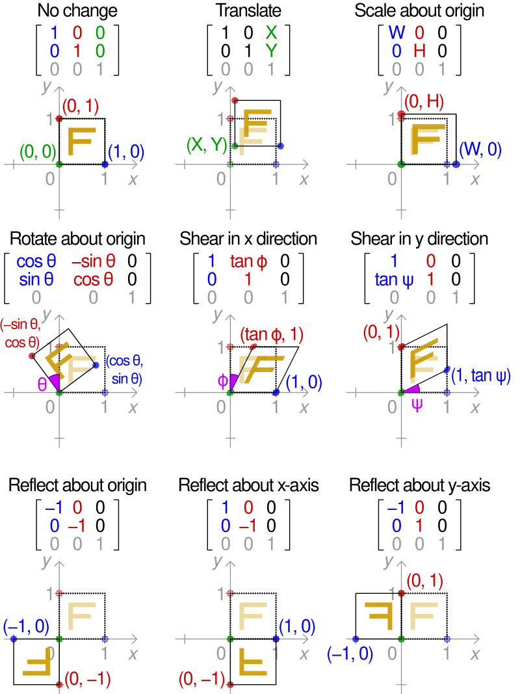

### Definition

An affine transformation is a geometric transformation that preserves:
- Collinearity (points on a line remain on a line after transformation)
- Ratios of distances (the midpoint of a line segment remains the midpoint after transformation)
- But not necessarily Euclidean distances and angles

### Types of Affine Transformations:

1. `Translation`: Shifting the object by a constant distance in the x- and y- directions.
2. `Scaling`: Changing the size of an object by a factor along each axis.
3. `Rotation`: Rotating the object around the origin by an angle θ. 
4. `Shearing`: Distorting the object along one axis. 
5. `Reflection`: Reflecting the object about an axis. 

### Equation:
Affine transformations can be expressed in a single matrix multiplications


$$
\begin{bmatrix} 
 x' \\\ y' \\\ 1 \\\
\end{bmatrix} = \begin{bmatrix}
 a & b & t_{x} \\\
 c & d & t_{y} \\\
 0 & 0 & 1 \\\
\end{bmatrix} \begin{bmatrix} 
 x \\\
 y \\\
 1 \\\
\end{bmatrix}
$$


    
- \\(a,b,c,d\\) are the elements of the linear transformation matrix.  
- \\(t_{x},t_{y}\\)​ are the translations.  
- The third coordinate is set to 1 to allow the translation operation.


