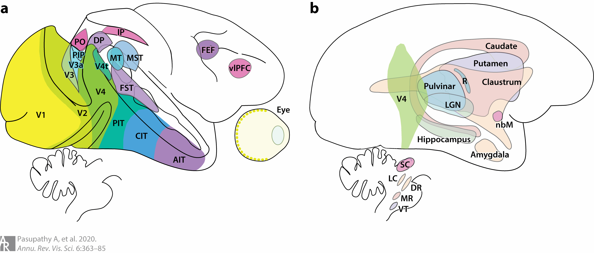
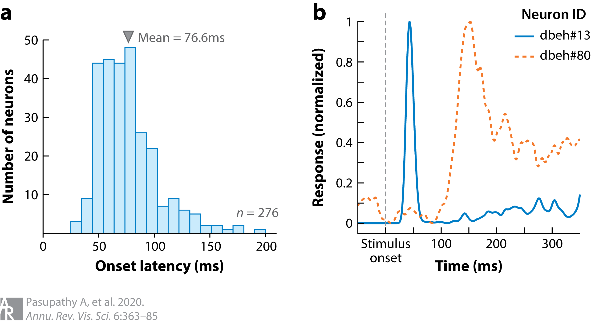
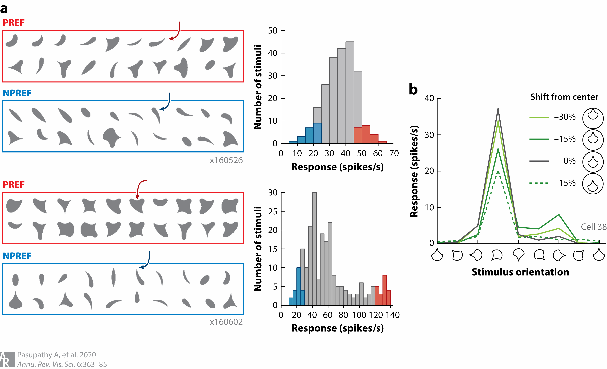
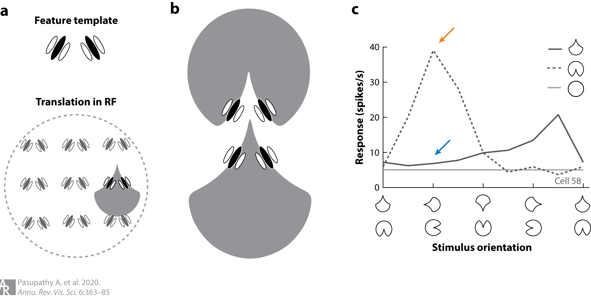
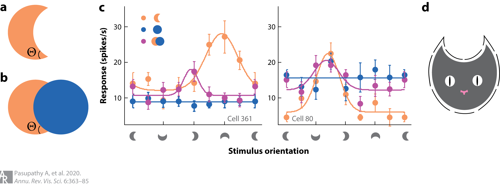
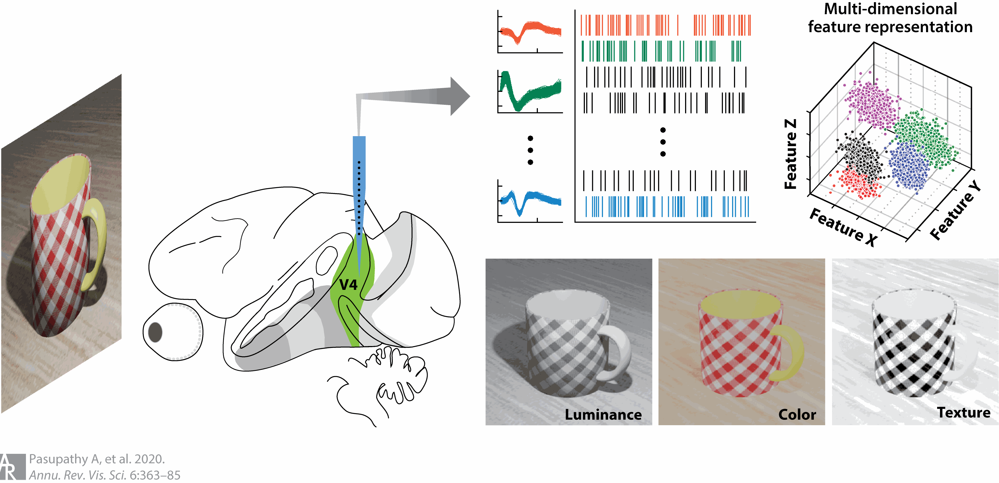
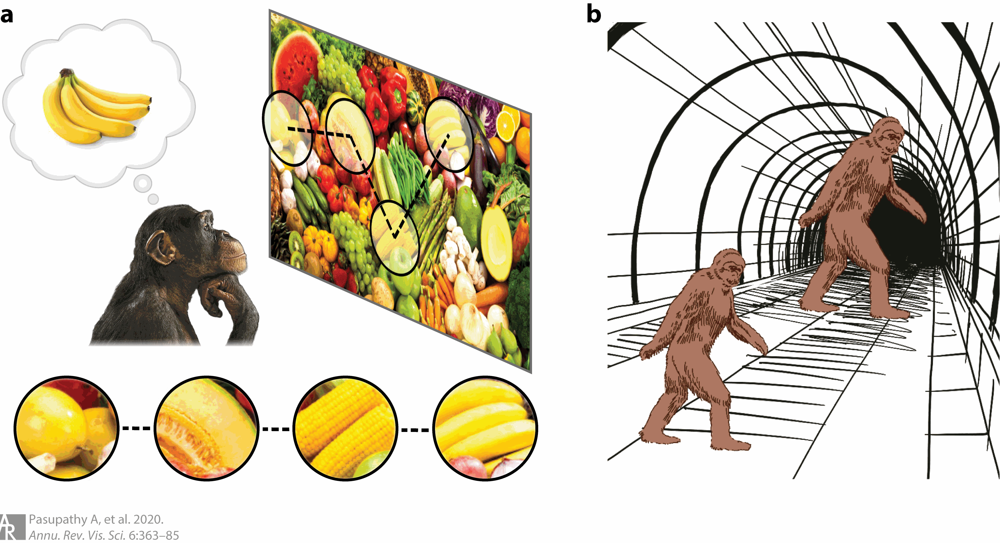
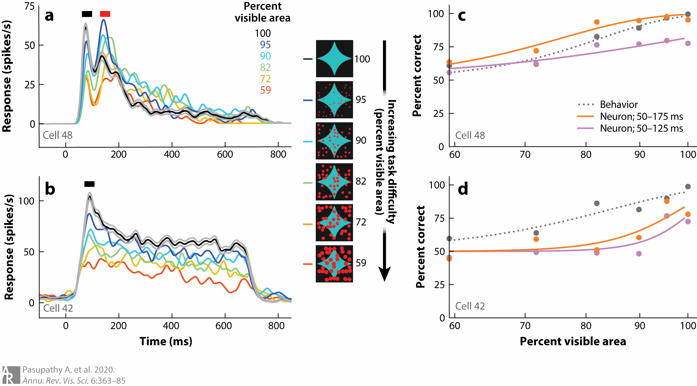
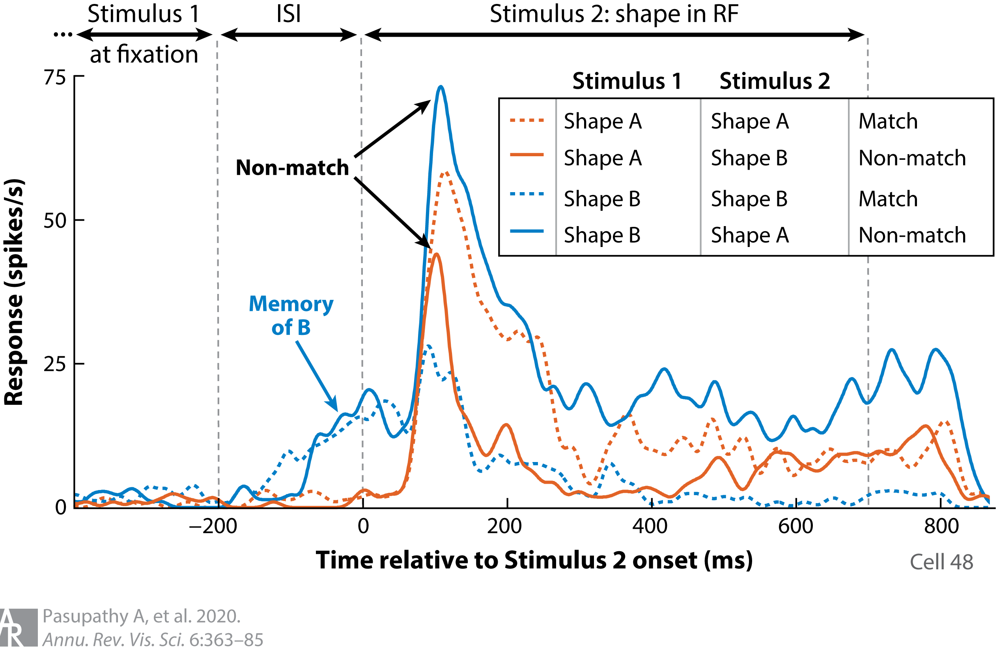

## Article info
|                    |                                                      |
|--------------------|------------------------------------------------------|
| `Authors`          | Anitha Pasupathy, Dina V Popovkina, Taekjun Kim      |
| `Publication date` | 2020/09/15                                           |
| `Journal`          | Annual Review of Vision Science                      |
| `DOI`              | https://doi.org/10.1146/annurev-vision-030320-041306 |

## Abstract
Area V4—the focus of this review—is a mid-level processing stage along the ventral visual pathway of the macaque monkey. V4 is extensively interconnected with other visual cortical areas along the ventral and dorsal visual streams, with frontal cortical areas, and with several subcortical structures. Thus, it is well poised to play a broad and integrative role in visual perception and recognition—the functional domain of the ventral pathway. Neurophysiological studies in monkeys engaged in passive fixation and behavioral tasks suggest that V4 responses are dictated by tuning in a high-dimensional stimulus space defined by form, texture, color, depth, and other attributes of visual stimuli. This high-dimensional tuning may underlie the development of object-based representations in the visual cortex that are critical for tracking, recognizing, and interacting with objects. Neurophysiological and lesion studies also suggest that V4 responses are important for guiding perceptual decisions and higher-order behavior. 

## Figures
### Fig1. Interconnections between V4 and other brain regions

Areas connected with V4 are highlighted on the lateral surface of the macaque monkey brain. (**a**) Visual cortical areas along the ventral stream, many along the dorsal visual stream and frontal areas, and (**b**) the medial temporal lobe and many subcortical structures are interconnected with V4. Figure created using data from Felleman & Van Essen (1991), Parker (2007), Ungerleider et al. (2008), Gattass et al. (2014), and Ninomiya et al. (2012a,b). Part of the figure was adapted with permission from Pasupathy et al. (2018). Abbreviations: AIT, anterior inferotemporal area; CIT, central inferotemporal area; DP, dorsal prelunate area; DR, dorsal raphe; FEF, frontal eye field; FST, fundus of the superior temporal sulcus area; IP, intraparietal areas; LC, locus coeruleus; LGN, lateral geniculate nucleus; MR, medial raphe; MST, medial superior temporal area; MT, middle temporal area; nbM, basal nucleus of Meynert; PIP, posterior intraparietal area; PIT, posterior inferotemporal area; PO, parieto-occipital area; R, thalamic reticular formation; SC, superior colliculus; V3a, visual complex V3 part A; V4t, V4 transition zone; vlPFC, ventrolateral prefrontal cortex; VT, ventral tegmentum.

### Fig2. Distribution of response onset latencies of V4 neurons

(**a**) Onset latencies of 276 V4 neurons from three monkeys. Latency measurements were based on the responses of single V4 neurons in animals engaged in a passive fixation task. As animals fixated a variety of shape stimuli were presented within the receptive field of the cell under study. Peristimulus time histograms (PSTHs) were constructed based on evoked responses of each neuron and onset latencies were calculated based on the half-height method, i.e., as the time point at which the PSTH exceeded the mean of the peak and baseline rates. Onset latencies ranged from 25 ms to 200 ms; mean latency was 76.6 ms. For further details, see Zamarashkina et al. (2020). (**b**) PSTHs of two example V4 neurons studied during passive fixation, displaying approximately 100 ms difference in onset latency. PSTHs were aligned on stimulus onset and smoothed with a Gaussian kernel (σ = 4 ms).

### Fig3. Position-invariant tuning for boundary conformation in V4

(**a**) Examples of tuning for boundary conformation. Responses of two example V4 neurons (top and bottom) to simple 2D shapes recorded in a fixating animal (for further details, see Kim et al. 2019a). Response frequency histograms (right) show that the shape stimuli evoked a broad range of responses from both neurons. The 20 shapes that evoked the strongest (PREF, red) and weakest (NPREF, blue) responses are shown for each neuron (left). For the top neuron, all of the preferred shapes included a medium-sharp convex feature to the upper right; shapes that evoked a weak response did not include this feature (compare PREF and NPREF shapes). For the second neuron, preferred but not nonpreferred shapes included a concavity at the top of the shape. Responses of both neurons can be well-explained by a two-dimensional angular position × boundary curvature model that captures the conformation of the shape boundary (Kim et al. 2019a). Panel adapted from Kim et al. (2019a) (CC BY 4.0). (**b**) Example of position-invariant shape tuning. This neuron shows strong narrow tuning for the orientation of a shape stimulus, responding best when the sharp convex projection is to the lower left. Shape selectivity was consistent irrespective of the absolute position of the shape within the receptive field (compare tuning for the different lines). The response magnitude varied across position, but the preference remained the same.

### Fig4. Object-centered tuning for boundary conformation in V4

(**a**) Preference for a sharp convexity pointing up could be achieved by pooling signals from units tuned to an appropriate combination of orientations (feature template) and repeating the template at multiple positions [translation in the receptive field (RF)]. (**b**) This model would predict similar responses to the two shapes shown, one with a convex projection at the top of the shape and the other with a concave contour at the bottom of the shape, and would therefore not represent an object-centered code. (**c**) Example of object-centered tuning for contour conformation. Responses of this neuron show clear rotation tuning for a shape with a concave feature along the boundary. Responses are strongest (orange arrow) when the concavity is to the right of shape center. When the same boundary conformation forms a convex projection to the left of shape center, responses are weak (blue arrow). Thus, responses are not dictated by contour conformation alone.

### Fig5. Representation of real but not accidental object boundaries in V4

(**a, b**) Accidental versus real contours. The angle Θ in panel a is a real contour, while in panel b, it is formed by the accidental occlusion of one circle by another. Accidental contours bound the occluded object, but they carry no information about its true shape, and they are perceptually discounted. (**c**) Responses of two example neurons that encode real but not accidental contours. We studied responses of neurons to crescent shapes in eight orientations (x axis), either in isolation (orange) or in combination with a circle (magenta); the circle was also presented in isolation (blue) at the same eight positions in the receptive field as in the combination stimulus. The neuron on the left responds preferentially to shapes with a sharp convexity at the bottom, as reflected in the tuning curve for the crescent alone (orange). When the crescent is formed by partial occlusion in the case of the combination stimulus, responses are suppressed (magenta) because the preferred sharp convexity is now an accidental feature. The neuron on the right responds best to shapes with a broad convexity to the upper right, consistent with the strong responses to the circle alone (blue). In this case, responses are not suppressed with the addition of a circle because the preferred broad convexity remains a real contour (for further details, see Bushnell et al. 2011b). (**d**) A population of V4 neurons can provide a complete representation of isolated shapes based on the component contour features. For example, the cat may be encoded by V4 neurons selective for sharp convexities to the upper right and upper left; concavity to the top; and broad convexities to the right, left, and bottom (see Pasupathy & Connor 2002). Panels a–c adapted from Bushnell et al. (2011b) (CC BY-NC-SA 3.0).

### Fig6. Joint encoding of multiple features for object segmentation

The input image on the left includes a variety of cues; the bottom images are filtered to include information from each cue in isolation and illustrate that form information may be encoded by a contrast in luminance, color, or texture. When viewing such a stimulus, responses of individual V4 neurons are dictated by tuning in a high-dimensional stimulus space defined by shape, luminance, color, texture, blur, depth, etc., which facilitates the effective segmentation of visual objects from the background that may be defined by contrast along a variety of stimulus dimensions.

### Fig7. Goal-oriented representations

(**a**) When confronted with the challenge of spotting bananas in a cluttered produce aisle, the subject may saccade to different locations with yellow objects (dashed trajectory) and compare the shape of the object at the attentional focus (circles) with a remembered object. Area V4 is thought to be important for all aspects of this process. (**b**) Size illusion. The retinal sizes of the two sasquatches in this image are identical, but the perceived sizes are dramatically different. This is because the surrounding context suggests that the sasquatch at right is farther away from the observer; thus, the same retinal size would imply a much larger sasquatch farther away.

### Fig8. Interactions between the visual and frontal cortex during shape discrimination

(**a, b**) Responses of two example V4 neurons that exhibit different response profiles to partially occluded shape stimuli. PSTHs in panel a exhibit two transient peaks (black and red bars), while those in panel b exhibit only one transient peak (black bar). During the first transient in both neurons, responses decline with increasing levels of occlusion (line colors; decreasing percent visible area). During the second transient in panel a, which may be based on feedback from frontal cortex, responses are stronger for intermediate levels of occlusion (for further details, see Fyall et al. 2017, Kosai et al. 2014). Adapted from Fyall et al. (2017) (CC-BY). (**c, d**) Psychometric and neurometric curves based on the data in panels a and b, respectively. In both, psychometric performance (dark gray dotted line) declines with increasing levels of occlusion. The neurometric curve based on a larger time window (orange line) shows improved performance at intermediate levels of occlusion for the neuron in panel a but not the one in panel b due to the enhanced shape selectivity for occluded stimuli during the second transient peak.

### Fig9. Memory encoding in V4

Responses of an example neuron during the performance of a sequential shape-discrimination task are shown. Stimulus 1 was presented at central fixation (outside the receptive field of the neuron), followed by an inter-stimulus interval (ISI), and stimulus 2 was presented within the receptive field (RF). The animal had to report whether stimuli 1 and 2 were the same or different. Stimulus 1 and stimulus 2 could be shapes A or B, for a total of four conditions (for details, see Kosai et al. 2014). Responses of this neuron include three task-relevant pieces of information. First, the responses provide a sensory representation of stimulus 2 with stronger responses for shape A than shape B (compare the blue solid line and orange dashed line with the other two lines). Second, a memory representation of stimulus 1 is also evident during the ISI (blue arrow), with stronger responses when stimulus 1 was shape B (blue lines) rather than shape A (orange lines). Finally, responses also reflect whether stimuli 1 and 2 were the same or different with stronger responses during the presentation of stimulus 2 when stimuli 1 and 2 were different (solid lines, black arrows).
