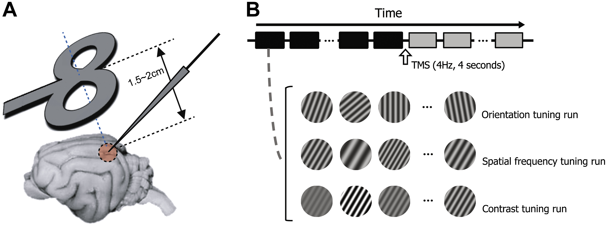
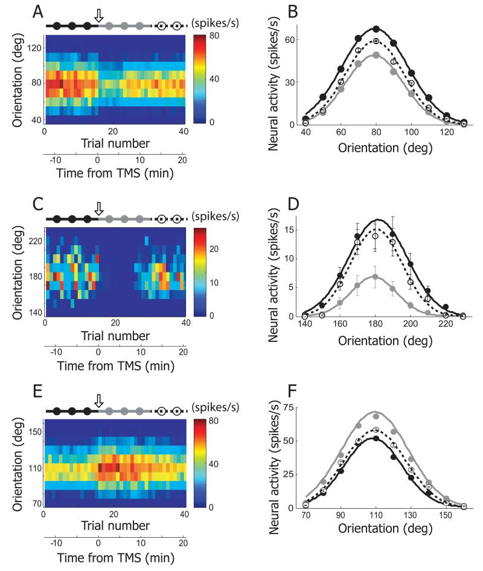
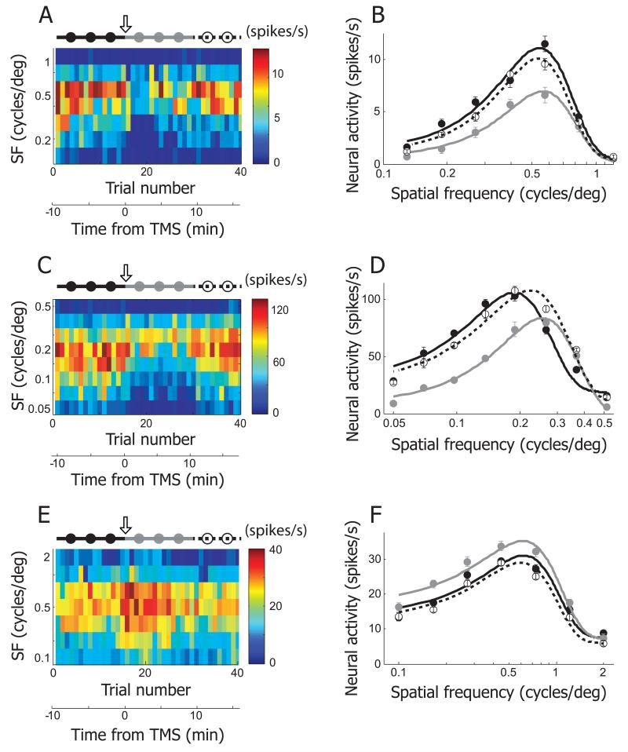
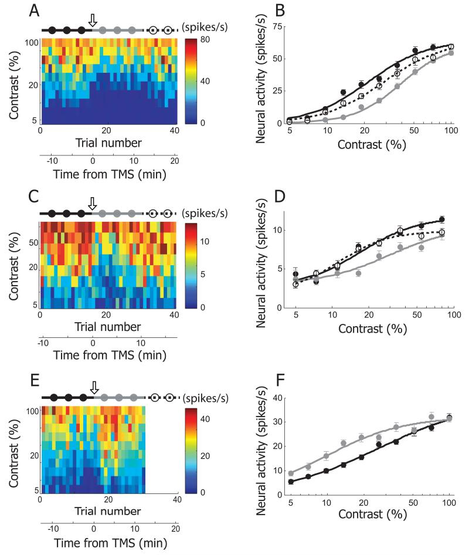
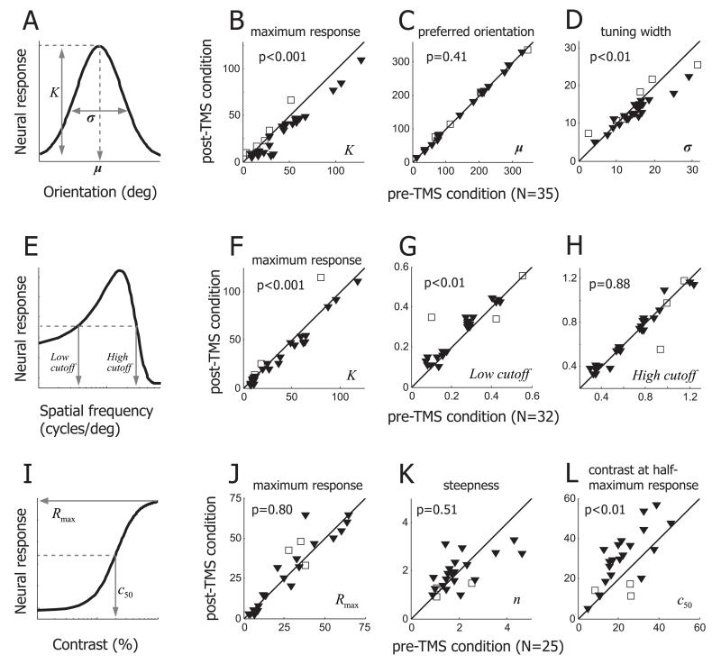

## Article info
|                    |                                                             |
|--------------------|-------------------------------------------------------------|
| `Authors`          | Taekjun Kim, Elena A Allen, Brian N Pasley, Ralph D Freeman |
| `Publication date` | 2015/05/01                                                  |
| `Journal`          | Brain stimulation                                           |
| `DOI`              | https://doi.org/10.1016/j.brs.2015.01.407                   |

## Abstract
- `Background`  
Transcranial magnetic stimulation (TMS) is used to selectively alter neuronal activity of specific regions in the cerebral cortex. TMS is reported to induce either transient disruption or enhancement of different neural functions. However, its effects on tuning properties of sensory neurons have not been studied quantitatively.
- `Objective/hypothesis`  
Here, we use specific TMS application parameters to determine how they may alter tuning characteristics (orientation, spatial frequency, and contrast sensitivity) of single neurons in the cat's visual cortex.
- `Methods`  
Single unit spikes were recorded with tungsten microelectrodes from the visual cortex of anesthetized and paralyzed cats (12 males). Repetitive TMS (4 Hz, 4 s) was delivered with a 70 mm figure-8 coil. We quantified basic tuning parameters of individual neurons for each pre- and post-TMS condition. The statistical significance of changes for each tuning parameter between the two conditions was evaluated with a Wilcoxon signed-rank test.
- `Results`  
We generally find long-lasting suppression which persists well beyond the stimulation period. Pre- and post-TMS orientation tuning curves show constant peak values. However, strong suppression at non-preferred orientations tends to narrow the widths of tuning curves. Spatial frequency tuning exhibits an asymmetric change in overall shape, which results in an emphasis on higher frequencies. Contrast tuning curves show nonlinear changes consistent with a gain control mechanism.
- `Conclusions`  
These findings suggest that TMS causes extended interruption of the balance between sub-cortical and intra-cortical inputs.

## Figures
### Fig1. Experimental paradigm

**A**. Figure-8 coil is positioned obliquely near the transverse plane superior to the visual cortex (1.5~2cm apart from the cortical surface). Its midpoint is aligned to the left visual cortex craniotomy (Horsley-Clarke coordinates P4 L2). Tungsten electrode penetration is made at an angle of A45, M0. **B**. We examine how rTMS alters selectivity of cells in the visual cortex. To do this, we measure orientation, spatial frequency, and contrast tuning properties of cells and compare the properties between pre- and post-TMS conditions. For orientation tuning run, 7~10 differently oriented circular grating patches (stimulus duration: 2 seconds, inter-stimulus interval: 2 seconds) are presented in a cell’s classical receptive field in each trial (depicted as squares below the time arrow). 4Hz TMS pulse train is delivered for 4 seconds in the inter-trial interval (10 seconds) between 15th and 16th trials. Black and gray colors are used to represent pre- and post-TMS conditions, respectively.

### Fig2. Three examples showing TMS effects on orientation selectivity

**A**. Neural response of an example cell is depicted as a form of matrix. X- and Y-axis indicate trial number and orientation, respectively. In each trial (column), 10 different orientations (40~130°, 10° step) were tested. Response magnitude is coded with colors on a blue-red scale. 4Hz rTMS (downward arrow) was delivered for 4 seconds just before the 16th trial. The total 40 trials are divided into three groups based on elapsed time from TMS delivery: pre-TMS (1~15th trials, black filled circles and line), post-TMS (16~30th trials, gray filled circles and line), and recovery (31~40th trials, open circles and dotted line) conditions. Trial number was translated into time from TMS delivery. Neural response was abruptly changed as soon as TMS was applied. The TMS effect was reversible and it lasted for approximately 10 minutes. **B**. Three orientation tuning curves were created from the cell depicted in (**A**). Black, gray, and open circles are mean neural responses for 10 different orientations computed in pre-TMS, post-TMS, and recovery conditions, respectively. Error bar indicates standard error of mean. Error bars are smaller than circles when not visible. In these three conditions, the preferred orientation is not changed but response magnitude is clearly diminished in post-TMS condition compared with the other two conditions. More detailed analysis of TMS-effects on orientation selectivity will be dealt in Figure 5A~D. **C, D**. Another example cell showing TMS effects on orientation selectivity. The same conventions are used as in (**A**), (**B**). The black circle at 180° is hidden by the open one. **E, F**. Our rTMS (4Hz, 4sec) mainly caused prolonged suppression of neural responses in cat’s visual cortex (80 out of 92 units). But, in small cases, TMS-induced facilitation was also observable. One example is introduced here.

### Fig3. Three examples showing TMS effects on spatial frequency selectivity

**A**. In this example cell, neural responses for 7 different spatial frequencies (0.13~1.2 c/deg, evenly distributed in logarithmic scale) were recorded in 40 trials. The plotting conventions are the same as in Figure 2A. 4Hz rTMS (downward arrow) was applied just before the 16th trial. The total 40 trials are divided into three groups to create tuning functions in pre-TMS (1~15th trials, black filled circles and line), post-TMS (16~30th trials, gray filled circles and line), and recovery (31~40th trials, open circles and dotted line) conditions. **B**. Spatial frequency tuning curves of pre-TMS, post-TMS and recovery conditions were created from the cell depicted in (**A**). Equation used for curve fitting is the same as the one used for orientation tuning. But spatial frequency tuning curve is not Gaussian shaped, because x-axis is transformed to logarithmic scale. The area under the gray curve (post-TMS condition) is smaller than those under the other two curves. Note that TMS-induced suppression is more apparent in low spatial frequency range than high spatial frequency range. More detailed analysis of TMS-effects on spatial frequency selectivity will be dealt in Figure 5E~H. **C, D**. Another example cell showing TMS effects on spatial frequency selectivity. **E, F**. This example shows TMS-induced facilitation in spatial frequency tuning run.

### Fig4. Three examples showing TMS effects on contrast selectivity

**A**. In this example cell, neural responses for 10 different contrast values (5~100%, evenly distributed in logarithmic scale) were recorded in 40 trials. The plotting conventions are the same as in Figure 2A. 4Hz rTMS (downward arrow) was applied just before the 16th trial. The total 40 trials are divided into three groups to create tuning functions in pre-TMS (1~15th trials, black filled circles and line), post-TMS (16~30th trials, gray filled circles and line), and recovery (31~40th trials, open circles and dotted line) conditions. B. Contrast tuning curves of pre-TMS, post-TMS and recovery conditions were created from the cell depicted in (**A**). The curves are fitted with the Naka-Rushton function. The area under gray curve (post-TMS condition) is smaller than those of the other two curves. Note that despite of TMS-induced suppression, response magnitude at the lowest (5%) and highest (100%) contrast is comparable in pre- and post-TMS condition. More detailed analysis of TMS-effects on contrast selectivity will be dealt in Figure 5I~L. **C, D**. Another example cell showing TMS effects on contrast selectivity. **E. F**. This example shows TMS-induced facilitation in contrast tuning run. Neural response for recovery condition was not recorded, so the matrix in (**A**) is blank between 31st and 40th trials.

### Fig5. Summary of TMS effects on response selectivity

**A, B, C, D**. TMS effects on orientation selectivity were tested in 35 cells. (**A**) Three parameters (K, μ, σ) representing the maximum neural response, preferred orientation, tuning width are taken from Gaussian fitting function. (**B**) Parameter K is compared between pre- and post-TMS conditions. Difference between two conditions is significant (Wilcoxon signed-rank test, p<0.001). TMS-induced suppression and facilitation cases are indicated by filled triangles and open squares, respectively. (**C**) Parameter μ is compared between pre- and post-TMS conditions. Regardless of suppression or facilitation, the preferred orientation is not affected by TMS. (**D**) Parameter σ is compared between pre- and post-TMS conditions. TMS-induced suppression often makes orientation tuning sharper, and this change (reduced tuning width) is statistically significant (Wilcoxon signed-rank test, p<0.01). **E, F, G, H**. TMS effects on spatial frequency selectivity were tested in 32 single units. (**E**) Parameter K represents the maximum neural response. Low and high cutoff spatial frequencies were defined as the lower and higher spatial frequencies evoking the half-maximum neural response, respectively. (**F**) Parameter K is significantly decreased in post-TMS condition (Wilcoxon signed-rank test, p<0.001). (**G**) Low cutoff spatial frequency is significantly higher in post-TMS than pre-TMS conditions (Wilcoxon signed-rank test, p<0.01). (**H**) High cutoff spatial frequency is not significantly changed between pre- and post-TMS conditions. **I, J, K, L**. TMS effects on contrast selectivity were tested in 25 single units. (**I**) Three parameters (Rmax, n, c50), taken from Naka-Rushton function, represent the saturated neural response, steepness of curve, stimulus contrast producing the half-maximum neural response, respectively. (**J**) Parameter Rmax is not significantly changed by TMS (Wilcoxon signed-rank test, p=0.80). (**K**) Parameter n is compared between pre- and post-TMS conditions. (**L**) Parameter c50 is significantly increased in post-TMS condition (Wilcoxon signed-rank test, p<0.01). Considering (**J**) and (**L**) together, results suggest that TMS effects on neural response are better explained by contrast-gain rather than response gain control.

