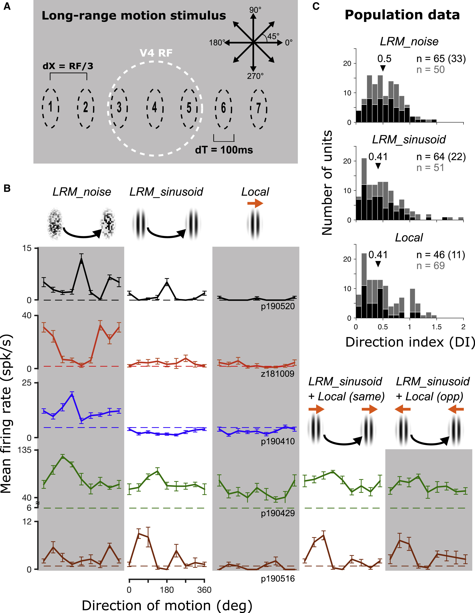
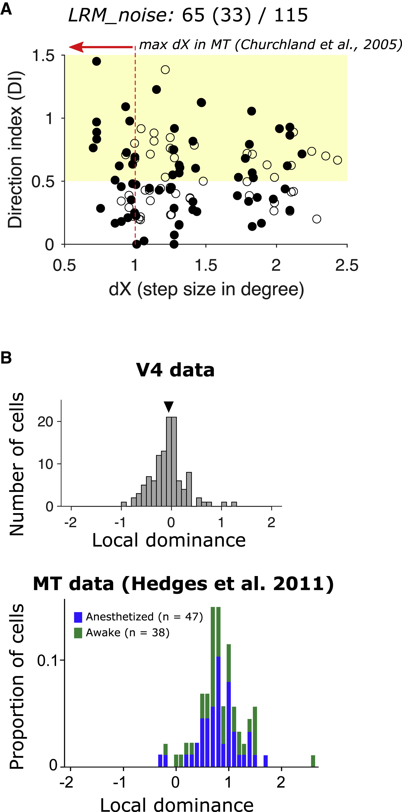
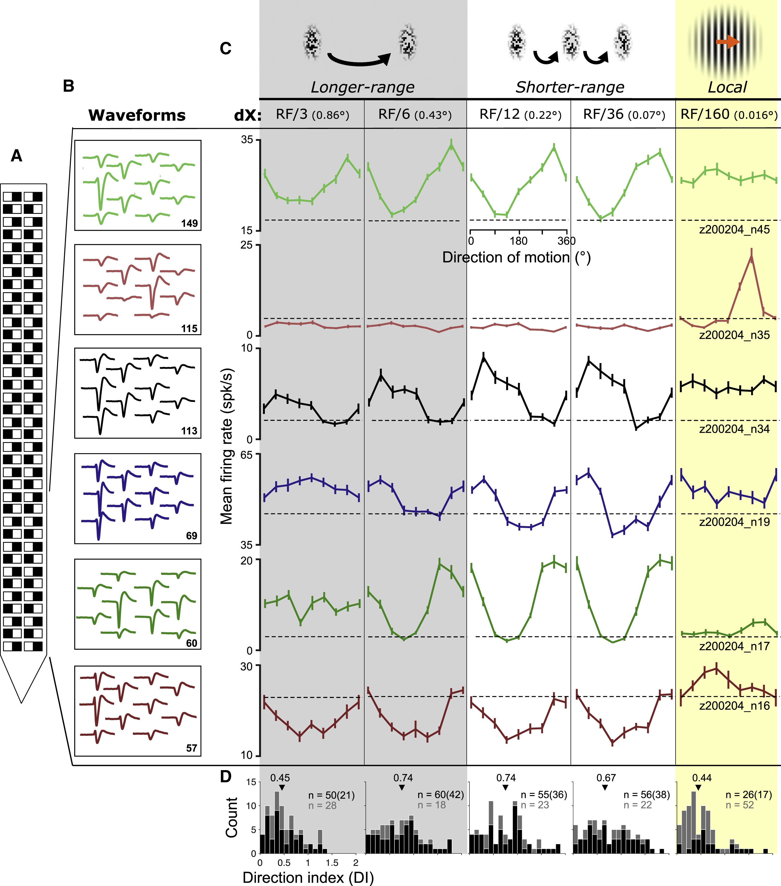
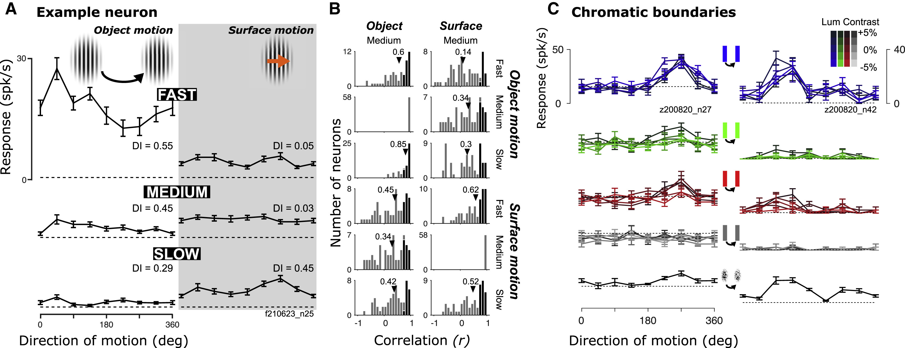
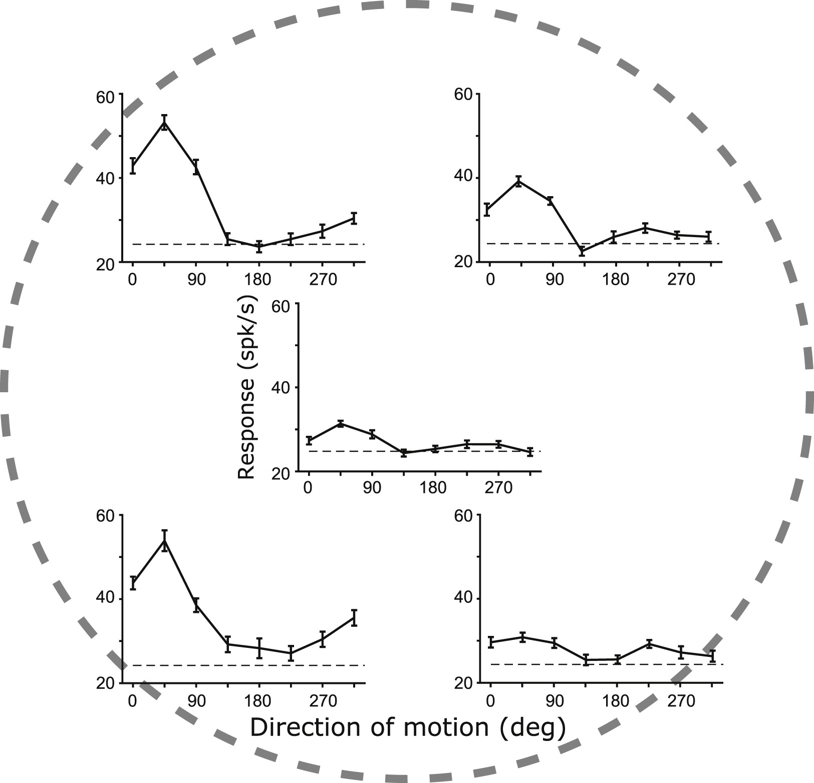
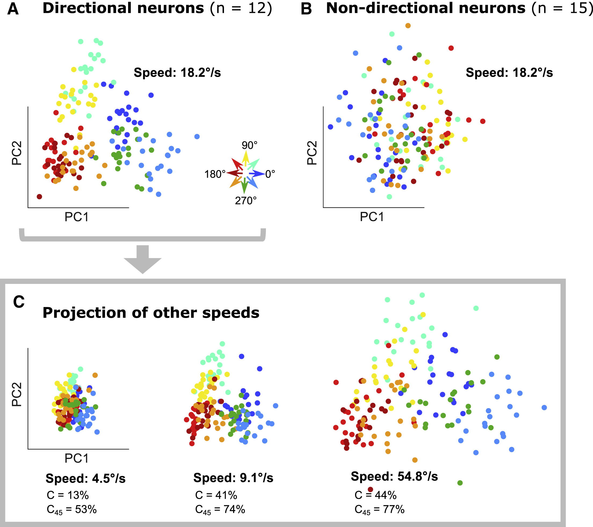

## Article info
|                    |                                                                               |
|--------------------|-------------------------------------------------------------------------------|
| `Authors`          | Anthony Bigelow*, Taekjun Kim*, Tomoyuki Namima, Wyeth Bair, Anitha Pasupathy |
| `Publication date` | 2023/02/03                                                                    |
| `Journal`          | Current Biology                                                               |
| `DOI`              | https://doi.org/10.1016/j.cub.2023.01.016                                     |

\* *These authors contributed equally*

## Abstract
A paradox exists in our understanding of motion processing in the primate visual system: neurons in the dorsal motion processing stream often strikingly fail to encode long-range and perceptually salient jumps of a moving stimulus. Psychophysical studies suggest that such long-range motion, which requires integration over more distant parts of the visual field, may be based on higher-order motion processing mechanisms that rely on feature or object tracking. Here, we demonstrate that ventral visual area V4, long recognized as critical for processing static scenes, includes neurons that maintain direction selectivity for long-range motion, even when conflicting local motion is present. These V4 neurons exhibit specific selectivity for the motion of objects, i.e., targets with defined boundaries, rather than the motion of surfaces behind apertures, and are selective for direction of motion over a broad range of spatial displacements and defined by a variety of features. Motion direction at a range of speeds can be accurately decoded on single trials from the activity of just a few V4 neurons. Thus, our results identify a novel motion computation in the ventral stream that is strikingly different from, and complementary to, the well-established system in the dorsal stream, and they support the hypothesis that the ventral stream system interacts with the dorsal stream to achieve the higher level of abstraction critical for tracking dynamic objects. 

## Figures
### Fig1. V4 responses to long-range motion stimuli

**A,** Stimulus design. An elliptical patch was displayed in sequence at seven locations centered on the RF (white circle, shown for illustration only). At each location, the stimulus was presented for 100 ms before disappearing and reappearing at the next location instantaneously. Spatial displacements were scaled to a third of the estimated RF diameter. Eight directions were tested; opposite directions sampled identical locations.  
**B,** Mean responses and SEM of five example neurons (rows) to long-range motion (LRM_noise and LRM_sinusoid) and drifting sinusoidal gratings (local). When LRM was combined with local motion in the same or opposite directions (LRM_sinusoid + local), tuning for LRM was similar. Dashed lines: baseline.
**C,** Population data. Histograms of DI values for LRM and local stimuli. Black/gray bars (and corresponding numbers) show neurons with/without statistically significant modulation by motion direction (one-way ANOVA, p < 0.05). Arrows: median DI across the dataset. Numbers in parentheses show neurons with DI ≥ 0.5 and statistically significant modulation.

### Fig2. Comparison of MT and V4 data

**A,** Size of the spatial displacement (dX) is plotted against DILRM_noise for each of the neurons in Figure 1. Filled symbols denote neurons that exhibit responses significantly modulated by motion direction (one-way ANOVA, p < 0.05). The shaded area represents moderate direction selectivity (DI ≥ 0.5). Red arrow denotes the range (0.25°–1°) of maximum dX values in V1 and MT.
**B,** Local dominance histograms for V4 data (top) from this study versus MT data (bottom), reproduced with permission from Hedges et al. DI values for LRM_sinusoid and local were calculated as in Hedges et al. For MT, local dominance is centered around 1, suggesting much stronger selectivity for local than LRM, unlike for V4 data.

### Fig3. Direction selectivity for object motion across spatiotemporal scales

**A,** Schematic of the Neuropixels probe showing a subset of the 384 contact pairs (black and white squares) along the shank.  **B,** Waveforms of six example neurons (colors) detected at multiple nearby contacts. Numbers indicate the contact associated with the largest amplitude waveforms.
**C,** Mean responses of example neurons as a function of motion direction for longer range (gray) and shorter range (white) object motion, and local gratings (yellow). Corresponding spatial step sizes (dX) are shown. Error bars: SEM.
**D,** Distribution of DI values. Black/gray bars (and n) show neurons with/without statistically significant modulation of responses by motion direction (one-way ANOVA, p < 0.05). arrows: median DI across the dataset. Numbers in parentheses show neurons with DI ≥ 0.5 and statistically significant modulation.

### Fig4. V4 direction sensitivity for object versus surface motion and chromatic boundaries

**A,** Direction tuning curves for an example neuron to object (left) and surface (right) motion at three speeds. Error bars: SEM. Dashed lines: baseline activity.
**B,** Population histograms of the correlation between tuning curves for object (left column)/surface (right column) motion versus those of other motion types and speeds (rows). Triangles denote median values. Filled bars identify neurons with statistically significant positive correlation (p < 0.05). Correlations within the same motion type (object × object or surface × surface) were higher than correlation between object and surface motion curves at all speeds.
**C,** Direction tuning curves for two example neurons (columns) measured with translating chromatic and achromatic bars (rows) at five luminance contrasts (see legend). Direction selectivity is evident for chromatic bars and noise patches (bottom row) but not achromatic bars.

### Fig5. Position invariance of motion direction selectivity

Responses of an example V4 neuron to object motion stimuli at five positions within the RF. Error bars: SEM. Dashed lines: baseline activity. At each position, object motion was created with three sequential stimulus patches with dX = RFd/6, dT = 50 ms in eight directions. The radial distance between the center stimulus location and the other locations was 1/3 × RFd. This neuron responded strongly at three of the five spatial positions. In all positions, the direction tuning curve was highly consistent and correlation in tuning was 0.68 (STAR Methods). Across 31 neurons studied with this paradigm, 11 exhibited statistically significant direction tuning at two or more locations. For these neurons, the mean aggregate correlation (STAR Methods) in direction tuning across locations was 0.61.

### Fig6. Population decoding of object motion direction

**A,** Low-dimensional representation (first two PCs) of the activity of the direction-selective sub-population of neurons for different object motion directions (colors) for speed = 18.2°/s; this yields a systematic, robust space for deciphering motion direction.
**B,** The same analysis as in (A), based on the activity of non-direction-selective neurons, produces weak/non-existent patterning.
**C,** Projection of data for other speeds from directional neurons onto the space derived in (A). Percent correct performance of a binary decision tree for decoding the object motion direction exactly (C) or within 45° (C45) is reported for each speed.
