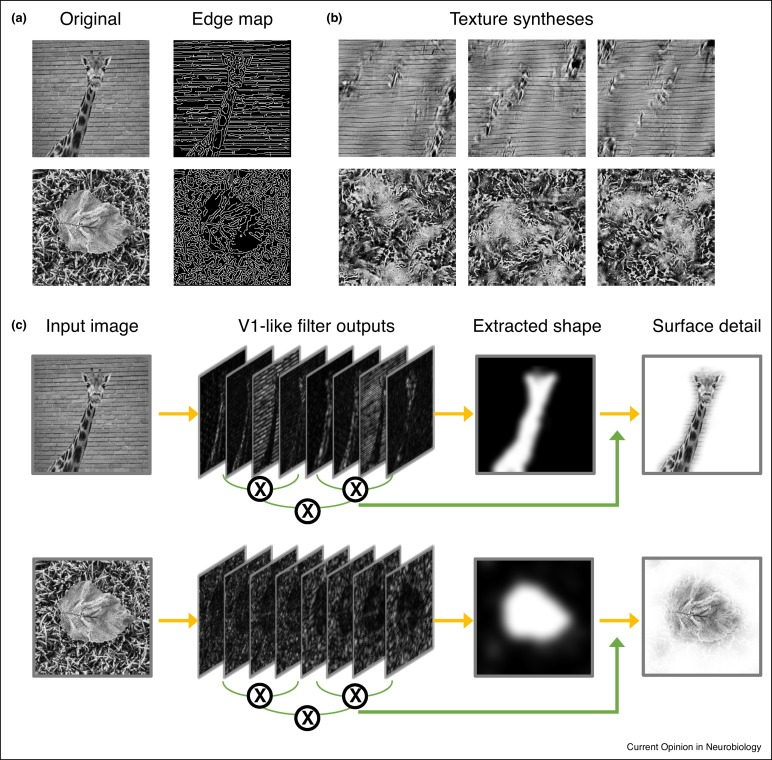
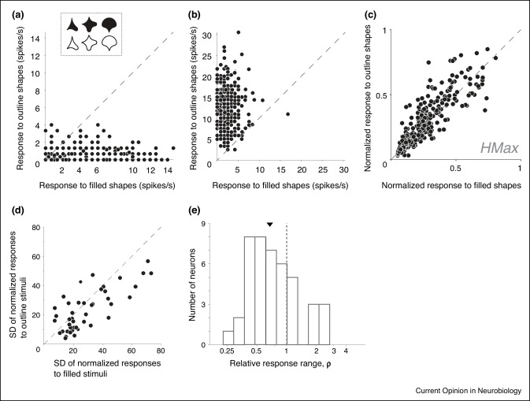
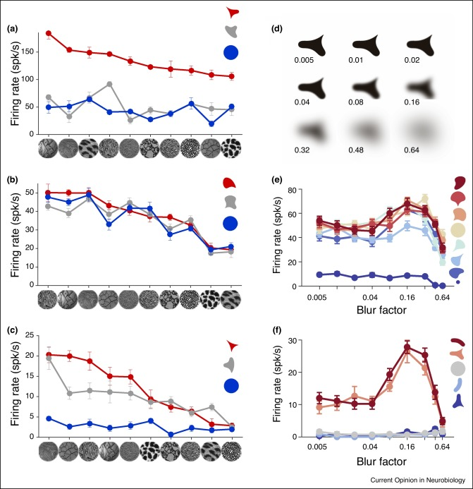
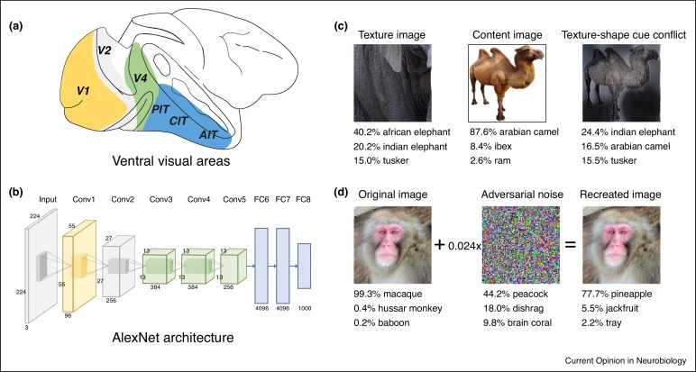

## Article info
|                    |                                                      |
|--------------------|------------------------------------------------------|
| `Authors`          | Anitha Pasupathy, Taekjun Kim, Dina V Popovkina      |
| `Publication date` | 2019/10/01                                           |
| `Journal`          | Current opinion in neurobiology                      |
| `DOI`              | https://doi.org/10.1016/j.conb.2019.09.009           |

## Abstract
Recognizing a myriad visual objects rapidly is a hallmark of the primate visual system. Traditional theories of object recognition have focused on how crucial form features, for example, the orientation of edges, may be extracted in early visual cortex and utilized to recognize objects. An alternative view argues that much of early and mid-level visual processing focuses on encoding surface characteristics, for example, texture. Neurophysiological evidence from primate area V4 supports a third alternative — the joint, but independent, encoding of form and texture — that would be advantageous for segmenting objects from the background in natural scenes and for object recognition that is independent of surface texture. Future studies that leverage deep convolutional network models, especially focusing on network failures to match biology and behavior, can advance our insights into how such a joint representation of form and surface properties might emerge in visual cortex.

## Figures
### Fig1. Candidate models for object recognition

(**a**) Deficiencies of a shape-based approach. Example natural scenes (left), and the component edges in the scenes (right) as computed by a Canny edge detector. These examples show that object shape segmentation based on edge-detection becomes very difficult when region contrast information (color, luminance, or texture) is not available. (**b**) Deficiencies of a texture-based approach. Each row shows multiple synthesized images using the Portilla–Simoncelli algorithm. They have the same higher-order texture statistics as the original images in (**a**), but global form is destroyed. (**c**) Framework for a new joint encoding model. The input image is first processed to extract V1-like features. Here the image is passed through a bank of 4 orientation × 2 spatial frequency filters, and the output is shown. Component objects in the image are extracted by identifying uniform image regions with K-means clustering (set to K = 2). Detailed processing of surface texture also starts from V1 outputs and runs in parallel. As proposed by Okazawa et al., the texture information is encoded by computing correlations in activity among neighboring neurons. This computation may be mediated by slow lateral cortical connections rather than fast feedforward connections.

### Fig2. Responses to filled and outline stimuli in V4

(**a**),(**b**) Results from two example V4 neurons (**a**) and (**b**) and from an instantiation of the Hmax model (**c**) are shown. Each point represents the mean response of a single neuron to a filled (X-axis) and an outline (Y-axis) stimulus with the same boundary shape (inset: stimulus examples). We recorded the responses of each neuron to 362 shapes. (**a**) An example neuron that evoked a larger range, and more shape-selective responses to filled shapes than outline shapes. (**b**) An example neuron that responded strongly and selectively to outlines, but not to filled stimuli. (**c**) A typical HMax model unit responds strongly and selectively to both filled and outline stimuli. Importantly, the responses are highly correlated. (**d**),(**e**) Responsiveness to filled and outline stimuli in a population of 43 V4 neurons. (**d**) Standard deviation (SD) of normalized responses to outline stimuli plotted against SD of normalized responses to filled stimuli; each point represents one neuron. Most points lie below the diagonal indicating that dispersion of responses across shapes was greater for filled shapes. (**e**) Distribution of relative response range, ρ, in the same population of neurons. For each neuron, this metric compares the responsiveness to outline versus filled stimuli (see Ref. [29••] for further details). Dashed line: similar responsiveness to filled and outline stimuli; left of dashed line, more responsive to filled stimuli; right of dashed line, more responsive to outline stimuli. Triangle indicates median.

### Fig3. Responses to shapes, textures, and boundary blur in V4

(**a**)–(**c**) Responses of example neurons to shapes (shown in each panel) with different textures painted on the surface. Line colors denote shape; textures are ordered along the X-axis in accordance with responses to the shape shown in red. For each neuron we chose a preferred shape (red) based on preliminary characterization, a less-preferred shape (gray) and a circle. Error bars indicate standard error of mean. (**a**) Example neuron with strong selectivity for shape but not texture. (**b**) Example neuron with strong selectivity for texture but not shape. All three line colors follow a similar trend. (**c**) Example neuron that is tuned to both shape and texture. In all three cases, tuning for shape and texture are separable and responses can be modeled as a product of tuning for shape × texture. (**d**),(**e**) Encoding of boundary blur in V4. (**d**) Stimuli with boundary blur. Blurring was achieved by applying a circular 2D Gaussian blur kernel to the shape. The numbers denote blur factor, which represents the standard deviation of the Gaussian kernel in units relative to the radius of the circle shape (see panel **c**). (**e**),(**f**). Two example neurons that exhibit tuning for blur. Responses to preferred (more red) and non-preferred (more blue) shapes are plotted as a function of the blur factor. Both neurons are selective for intermediate levels of blur. Tuning for blur was independent of the shapes used for this and other neurons [35••]. Error bars indicate standard error of mean. This figure is adapted with permission from [35••] under the Creative Commons Attribution 4.0 International License.

### Fig4. Deep convolutional neural nets and the primate ventral visual pathway

(**a**) Schematic of a macaque brain (side view) indicating ventral visual areas V1, V2, V4, and inferotemporal cortex (IT; PIT: posterior IT; CIT: central IT; AIT: anterior IT). (**b**) Schematic of AlexNet, an example deep convolutional network. Color coding identifies stages of the network and primate brain areas in (**a**) hypothesized to be analogous based on published results [V1: [65]; V4: [66•]; IT: [63]). (**c**),(**d**). Examples of images leading to classification failure in deep nets. (**c**). A conflict between texture and shape in the input image, generated by style transfer between the first two images [68••,69], produces texture-based classification of a camel as an elephant. (**d**) Adversarial noise [70] produces misclassification of a modified input image that is indistinguishable from the original by human observers. In this case, a macaque monkey is misclassified as a pineapple with considerable certainty despite minimal difference between the original and modified image.

