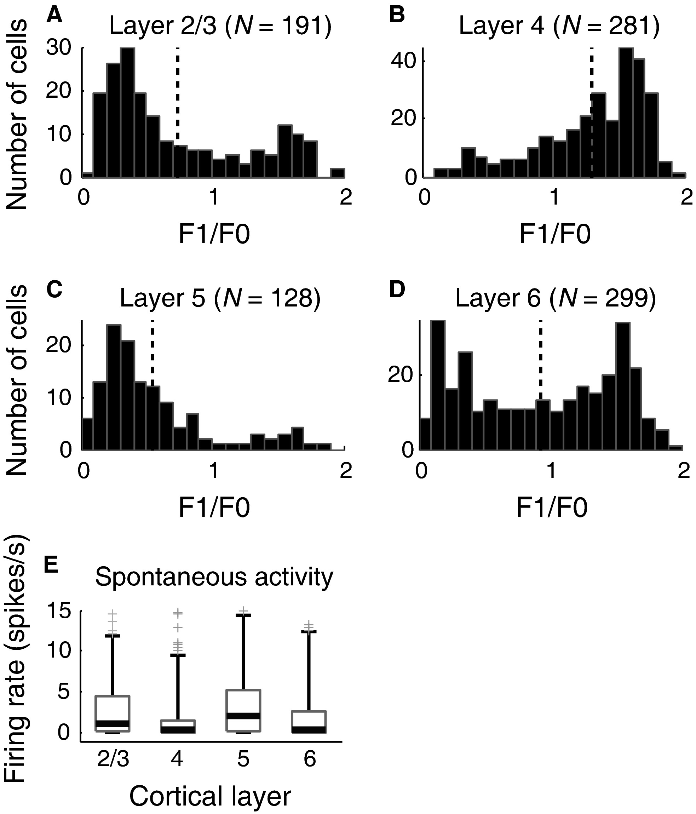
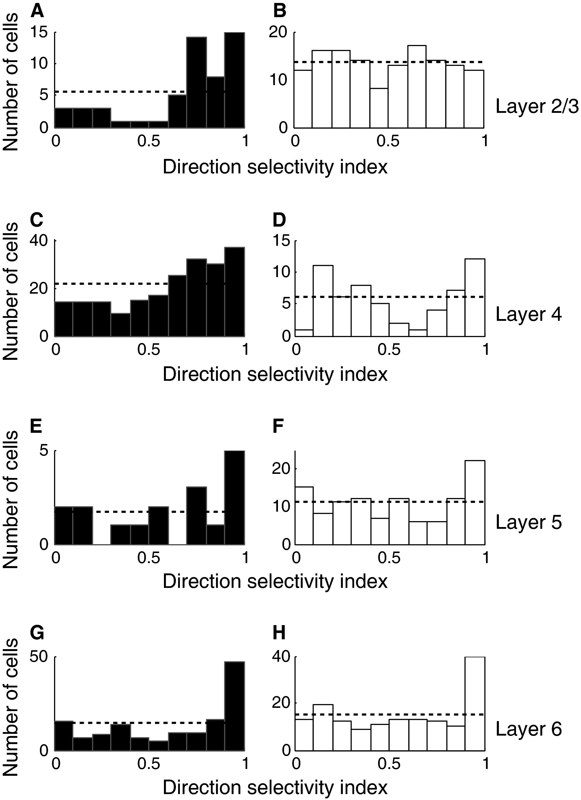
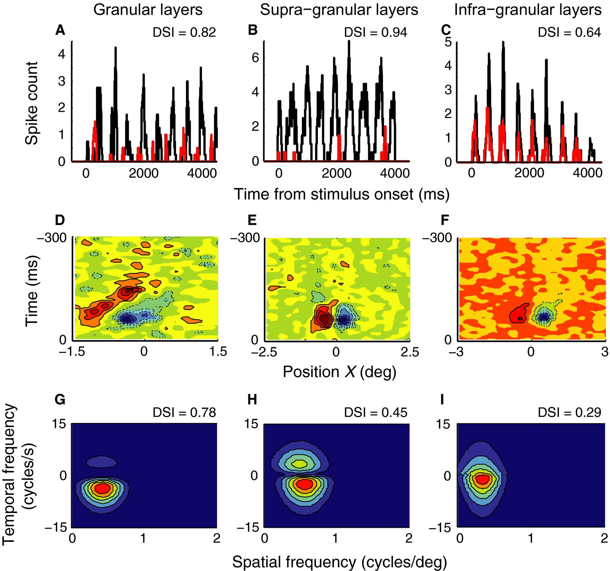
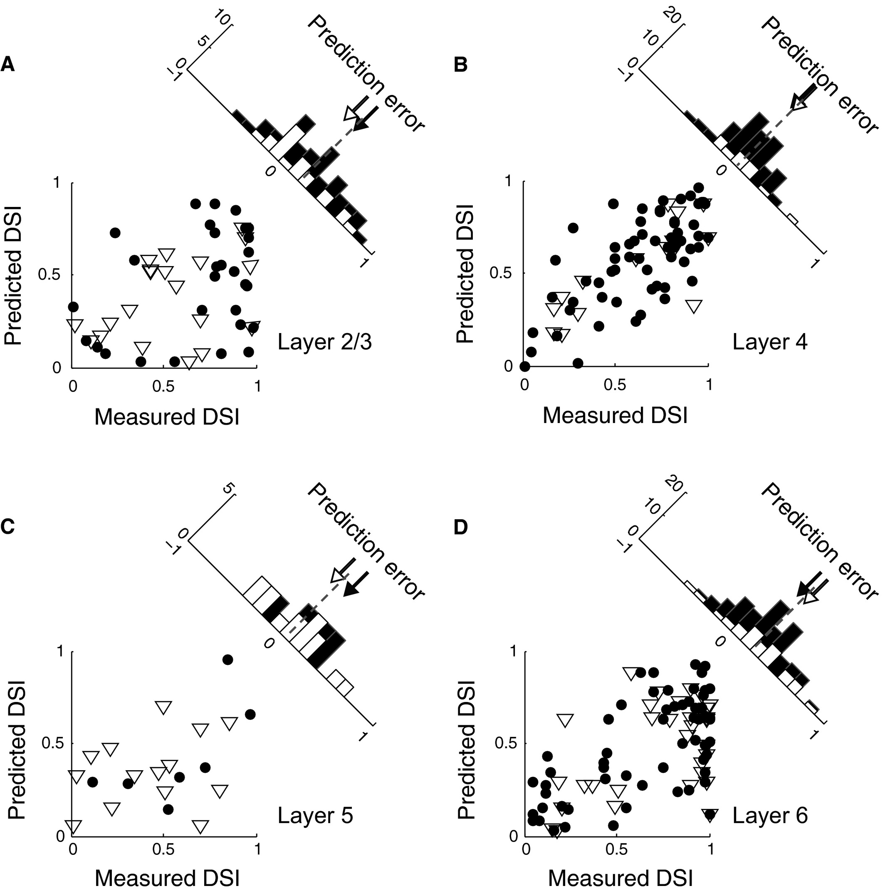
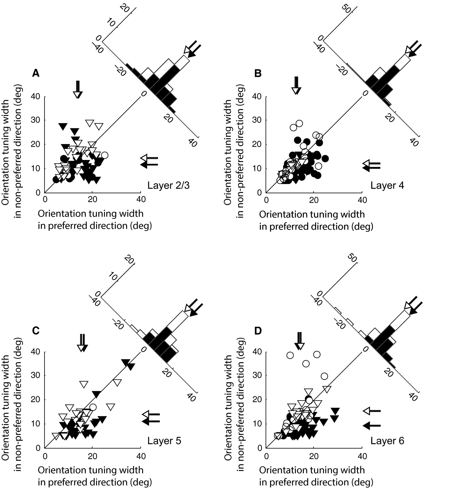

## Article info
|                    |                                   |
|--------------------|-----------------------------------|
| `Authors`          | Taekjun Kim, Ralph D Freeman      |
| `Publication date` | 2016/05/01                        |
| `Journal`          | European Journal of Neuroscience  |
| `DOI`              | https://doi.org/10.1111/ejn.13223 |

## Abstract
Neurons in the visual cortex are generally selective to direction of movement of a stimulus. Although models of this direction selectivity (DS) assume linearity, experimental data show stronger degrees of DS than those predicted by linear models. Our current study was intended to determine the degree of non-linearity of the DS mechanism for cells within different laminae of the cat's primary visual cortex. To do this, we analysed cells in our database by using neurophysiological and histological approaches to quantify non-linear components of DS in four principal cortical laminae (layers 2/3, 4, 5, and 6). We used a DS index (DSI) to quantify degrees of DS in our sample. Our results showed laminar differences. In layer 4, the main thalamic input region, most neurons were of the simple type and showed high DSI values. For complex cells in layer 4, there was a broad distribution of DSI values. Similar features were observed in layer 2/3, but complex cells were dominant. In deeper layers (5 and 6), DSI value distributions were characterized by clear peaks at high values. Independently of specific lamina, high DSI values were accompanied by narrow orientation tuning widths. Differences in orientation tuning for non-preferred vs. preferred directions were smallest in layer 4 and largest in layer 6. These results are consistent with a non-linear process of intra-cortical inhibition that enhances DS by selective suppression of neuronal firing for non-preferred directions of stimulus motion in a lamina-dependent manner. Other potential mechanisms are also considered. 

## Figures
### Fig1. Comparisons of F1/F0 distributions and spontaneous activity among four laminar groups

A total of 899 cells in our database were assigned to one of four layer categories on the basis of histological reconstruction. We classified simple and complex cells on the basis of the F1/F0 ratio, and quantified spontaneous activity from each neuron. Vertical dotted lines (**A–D**) indicate mean values of F1/F0 ratio distributions for four different layer groups. (**A**) F1/F0 distribution in layer 2/3. Fifty-five of 191 cells were classified as simple (F1/F0 ratio of >1). (**B**) F1/F0 distribution in layer 4. Two hundred and twenty of 281 cells were classified as simple. (**C**) F1/F0 distribution in layer 5. Seventeen of 128 cells were classified as simple. (**D**) F1/F0 distribution in layer 6. One hundred and 46 of 299 cells were classified as simple. (**E**) Spontaneous activity compared across layers 2/3, 4, 5, and 6. In each boxplot, the thick horizontal line within the box is the median (50th percentile), and the top and bottom edges of the box are the 25th and 75th percentiles of the dataset, respectively. The upper and lower vertical lines extend to cover 95% of the entire data distribution. The grey cross marks outside the range indicate outliers. Extreme outliers (>15 spikes/s) are omitted.

### Fig2. DSI distributions for four laminar groups

DSI values were calculated according to 1− (np/p), where p and np indicate neural responses for preferred and non-preferred (180° away from the optimal value) directions, respectively. (**A** and **B**) DSI distribution for layer 2/3. Filled and unfilled bars represent simple cells (F1/F0 ratios of >1 or <1, respectively). The horizontal dotted line designates a mean uniform DSI distribution. (**C** and **D**) DSI distribution for layer 4. The same format is used as in A and B. (**E** and **F**) DSI distribution for layer 5. (**G** and **H**) DSI distribution for layer 6.

### Fig3. Linear predictions of DSI values made for three representative simple cells

(**A**) Peri-stimulus time histograms for preferred (black) and non-preferred (red) directions of motion were calculated for a simple cell in the granular layer. The numbers of spikes were counted for a 50-ms sliding window with 1-ms steps. The DSI value measured with moving grating stimuli for this cell was 0.82. (**D**) X–T profile of the spatiotemporal linear RF of the simple cell described in A. Red colour with solid contour lines represents the bright excitatory (or ON) sub-region of the RF. Blue colour with dashed contour lines represents the dark excitatory (or OFF) sub-region of the RF. (**G**) A two-dimensional Fourier transform applied to the X–T plot in **D**. The amplitude spectrum for positive temporal frequency reflects the neural response for rightward direction of motion. The contour map shows the best fit of Eqn 2. The DSI value predicted from this amplitude spectrum is 0.78. (**B, E**, and **H**) Linear prediction of the DSI value made for a simple cell in the supra-granular layer. The same conventions are used as in **A, D**, and **G**. (**C, F**, and **I**) Linear prediction of the DSI value is made for a simple cell in the infra-granular layer. The same conventions are used as in **A, D**, and **G**.

### Fig4. Comparisons of measured and predicted DSI values

(**A**) Simple (N = 61, filled circles) and complex (N = 15, open triangles) cells in layer 4. The values plotted on the x-axis and y-axis indicate DSI values measured with grating stimuli and those predicted from the spatiotemporal amplitude spectrum, respectively. The histogram in the upper right shows the distribution of prediction errors (measured DSI – predicted DSI). The dashed line indicates the mean value of the distribution. Open and closed arrows indicate mean values of corresponding shaded sub-distributions. (**B**) Simple (N = 29) and complex (N = 20) cells in layer 2/3. The same format is used as in A. (**C**) Simple (N = 7) and complex (N = 14) cells in layer 5. The same format is used as in A. (**D**) Simple (N = 61) and complex (N = 31) cells in layer 6. The same format is used as in **A**. Note that the distributions of prediction errors are centred at zero for layer 4, but are clearly shifted to positive values for both supra-granular and infra-granular layers.

### Fig5. Comparisons of orientation tuning widths between preferred and non-preferred directions of motion

(**A**) Data from 66 units in layer 2/3. The x-axis and y-axis indicate orientation tuning widths (parameter σ of the Gaussian fitting curve) obtained for preferred and non-preferred directions of motion, respectively. Circles and triangles represent simple and complex cells, respectively. Direction-selective cells (filled symbols, DSI ≥ 0.5) and non-direction-selective cells (open symbols, DSI < 0.5) are indicated. The arrows for each axis indicate mean values of corresponding shaded units. The histogram in the upper right shows the distribution of differences of orientation tuning widths between two opposite directions (preferred and non-preferred directions). For direction-selective (but not non-direction-selective) cells, orientation tuning curves for non-preferred directions tend to be narrower than those for preferred directions. (**B**) Data from 110 cells in layer 4. The same format is used as in **A**. (**C**) Data from 47 cells in layer 5. The same format is used as in **A**. (**D**) Data from 98 cells in layer 6. The same format is used as in **A**. Note that the amount of decrease in orientation tuning width in the non-preferred direction differs according to cortical layer. It increases gradually in the direction of visual information flow (layer 4 → layer 2/3 → layer 5 → layer 6).
