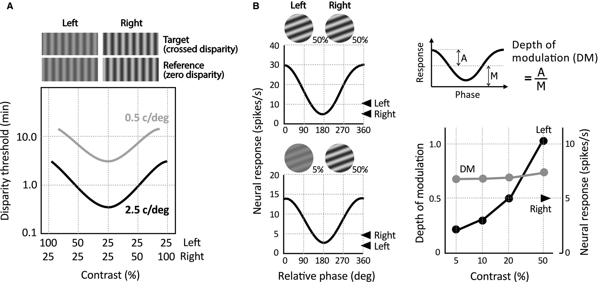
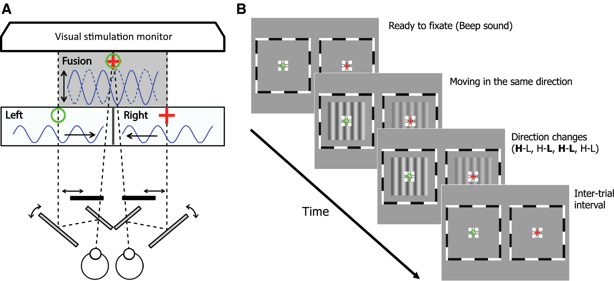
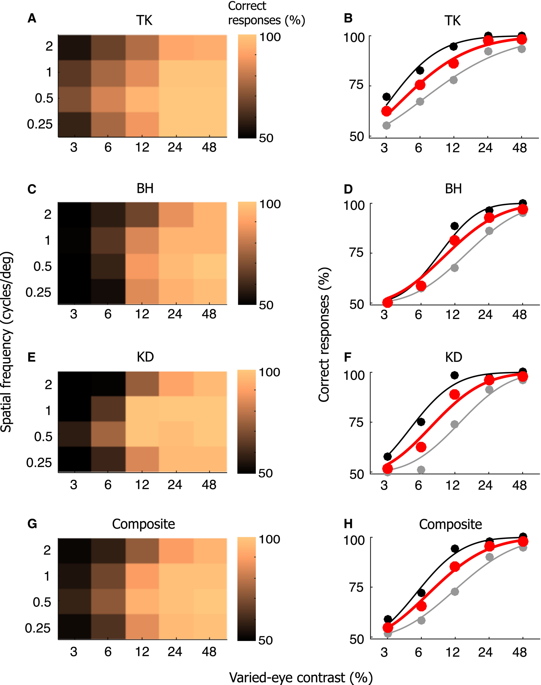
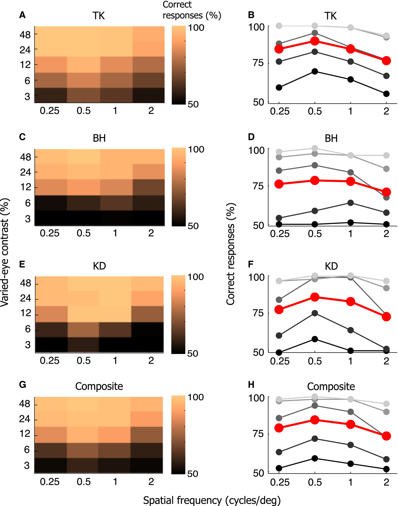
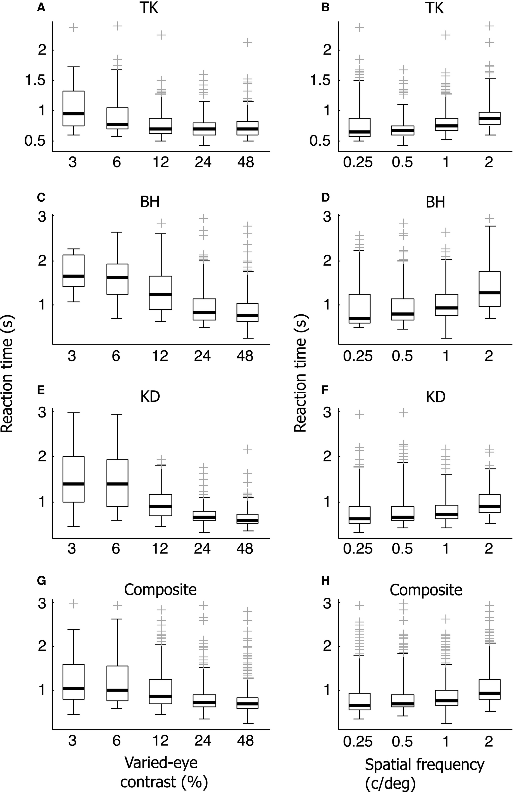

## Article info
|                    |                                   |
|--------------------|-----------------------------------|
| `Authors`          | Taekjun Kim, Ralph D Freeman      |
| `Publication date` | 2017/02/01                        |
| `Journal`          | European Journal of Neuroscience  |
| `DOI`              | https://doi.org/10.1111/ejn.13500 |

## Abstract
The fine task of stereoscopic depth discrimination in human subjects requires a functional binocular system. Behavioral investigations show that relatively small binocular abnormalities can diminish stereoscopic acuity. Clinical evaluations are consistent with this observation. Neurons in visual cortex represent the first stage of processing of the binocular system. Cells at this level are generally acutely sensitive to differences in relative depth. However, an apparent paradox in previous work demonstrates that tuning for binocular disparities remains relatively constant even when large contrast differences are imposed between left and right eye stimuli. This implies a range of neural binocular function that is at odds with behavioral findings. To explore this inconsistency, we have conducted psychophysical tests by which human subjects view vertical sinusoidal gratings drifting in opposite directions to left and right eyes. If the opposite drifting gratings are integrated in visual cortex, as wave theory and neurophysiological data predict, the subjects should perceive a fused stationary grating that is counter-phasing in place. However, this behavioral combination may not occur if there are differences in contrast and therefore signal strength between left and right eye stimuli. As expected for the control condition, our results show fused counter-phase perception for equal inter-ocular grating contrasts. Our experimental tests show a striking retention of counter-phase perception even for relatively large differences in inter-ocular contrast. This finding demonstrates that binocular integration, although relatively coarse, can occur during substantial differences in left and right eye signal strength. 

## Figures
### Fig1. Previous studies: effects of unequal monocular contrast on disparity sensitivity (psychophysics) and binocular phase tuning (neurophysiology).

(**A**) Replotted from Legge & Gu (1989). Disparity threshold was measured as a function of spatial frequency and unequal monocular contrast. Human subjects were provided with four panels of vertical sign-wave gratings. Left and right eyes could see only the left and right columns of the panels respectively. The bottom pair of grating panels formed a reference stereo image (zero disparity). The top pair of grating panels, which are identical to the reference except for spatial phase, formed a near (crossed disparity, phase-shifted inward as shown at the top of **A**) or far (uncrossed disparity) target stereo image. When an equal stimulus contrast (25%) was used for left and right eye stimulation, subjects could easily detect a target image with a small disparity. However, as stimulus contrast for one eye became higher (i.e., unequal monocular contrast), the disparity detectability of a target was gradually impaired. Similar effects were found for two spatial frequencies as shown. (**B**) Neurophysiological data from single cells in visual cortex. Gratings at optimal orientation and spatial frequency are presented at 50% contrast to left and right eyes as relative intraocular phase is varied. (**B** top). A similar test is shown (**B** bottom) for the same cell in which contrast of the grating for one eye is reduced by a log unit to 5%. Although overall response is reduced, relative phase tuning is closely similar to that for equal left and right eye contrast stimulation. Depth of modulation (DM), computed as illustrated in the upper right, is plotted against varied- eye contrast (lower right). As shown, DM is nearly flat across a range of contrast differences between left and right eyes. For comparison, a contrast response function is shown for the left eye alone.

### Fig2. Apparatus and stimuli

(**A**) A mirror haploscope is used to present two separate views to each eye. It consists of two pairs of vertically mounted mirrors (gray rectangles) and a pair of screens (black rectangles) in front of them toward the visual stimulation monitor. The angles of the two large mirrors and horizontal positions of the two screens are adjusted by individual subjects to achieve optimal fusion of left and right eye images. In the depicted situation, the left eye is stimulated with a vertical sign-wave grating drifting rightward. The grating stimulus in the right visual field is the same as that for the left, but it moves in the opposite (leftward) direction. Binocular fusion of these two stimuli is expected to result in the perception of a counter-phase flickering grating. (**B**) Each trial begins with a view of binocular-fusion-assisting frames and a dichoptic cross (Ding & Levi, 2011). Left and right frames contain opposite halves of the cross, which are combined during optimal fusion. Subjects are instructed to try to maintain perception of a red cross within a green circle just before activating the space bar to report detection of the counter-phase grating. A beep signals presentation of two vertical sign-wave gratings, which are identical except for contrast. (One is fixed at 48%, and the other has the same or a lower contrast. The eye presented with a higher contrast is varied). At first, the gratings move in the same direction at 0.5 cycles/s. Position of the higher contrast grating and direction of motion (left or right) are randomly chosen in each trial. After a delay of 2–3 s, also randomly chosen, a direction change occurs for one of the two grating stimuli. For each trial, **H**–L, H–**L**, or H & L indicate higher or lower contrast stimuli, respectively. The bold character means that a direction change occurs for that stimulus so as to form a counter-phase grating. If the subject detects this change, they report it and abort the trial by pressing the space bar and the reaction time is recorded. On half of the total trials, direction change occurs for both (**H–L**) and (H–L) conditions of grating stimuli. For these conditions, subjects are instructed to wait until the trial ends (5 s after stimulus onset) without depressing the space bar. Inter-trial interval is 5 s. The number of total stimulus conditions is 80 (4 × 5 × 4): Spatial frequencies (0.25, 0.5, 1, 2 cycles/deg), contrasts (3, 6, 12, 24, 48%), direction changes (**H**–L, H–**L**, **H–L**, H–L).

### Fig3. Effects of unequal monocular contrast on detection of counter-phase gratings

(**A, C, E, G**) Color matrices in left column show performance levels of three individual subjects and their average or composite values for the counter-phase grating detection task as a function of stimulus contrast (x-axis) and spatial frequency (y-axis). The brighter the color, the higher the percentage of correct answers. (**B, D, F, H**) Each row of color matrix data in the left column is replotted to show effects of unequal monocular contrast on detectability of counter-phase gratings. Only two out of four sets of data are shown here for visual clarity (Black: 0.5 cycles/deg; Gray: 2 cycles/deg). Red points represent mean values for all spatial frequency conditions. Psychometric curves are fitted with Weibull functions, urn:x-wiley:0953816X:media:ejn13500:ejn13500-math-0001. For all subjects, percentages of correct answers are lowest for highest spatial frequency condition. However, the relationship between detectability of counter-phase gratings and spatial frequency is non-linear (see more detail in Fig. 4).

### Fig4. Effects of spatial frequency on detection of counter-phase gratings

(**A, C, E, G**) Color matrices in left column contain the same information as that in Fig. 3. But they are transformed to show stimulus contrast on the y-axis and spatial frequency on the x-axis. The brighter the color, the higher the percentage of correct answers. (**B, D, F, H**) Each row of the color matrix in the left column is replotted to show effects of spatial frequency on detectability of counter-phase gratings. The brighter the data point, the higher the contrast condition. Red points represent mean values for all contrast conditions. Note that the best performance is observed at 0.5 cycles/deg., which is intermediate in the spatial frequency range we used.

### Fig5. Reaction times for detection of counter-phase gratings

(**A, C, E, G**) Reaction time distributions for the counter-phase grating detection task, are plotted against grating stimulus contrast. For each boxplot, the thick horizontal line within the box is the median (50th percentile), and the top and bottom edges of the box specify the 25th and 75th percentiles of the data set, respectively. The sum of the vertical lines above and below the boxes covers 99% of the entire data distribution. The gray cross-marks outside this range indicate outliers. Reaction times are gradually reduced as stimulus contrast of the varied-eye increases. (**B, D, F, H**) Reaction time distributions for the counter-phase grating detection task are plotted against spatial frequency. The same conventions are used as in the left column. Reaction times tend to increase with higher spatial frequency values.
