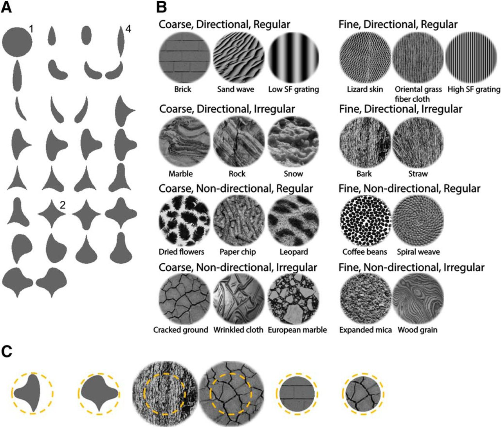
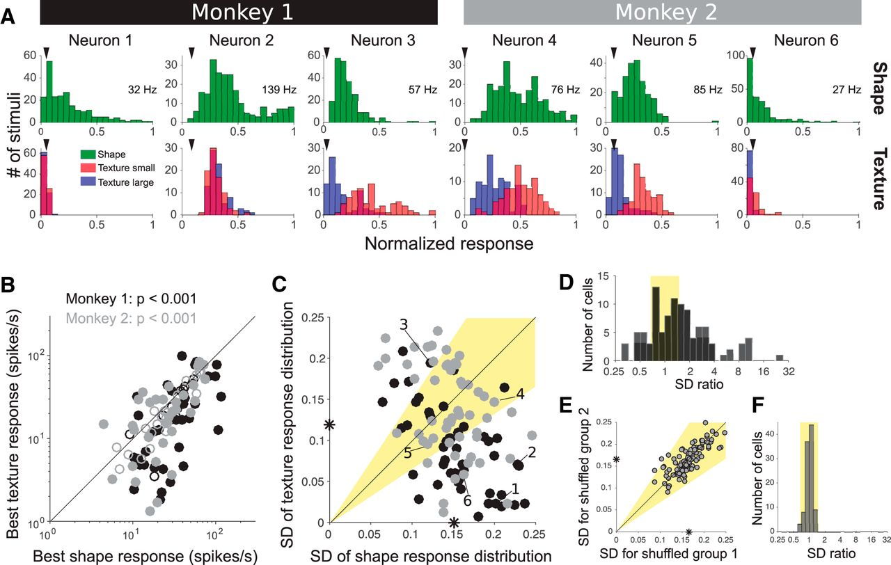
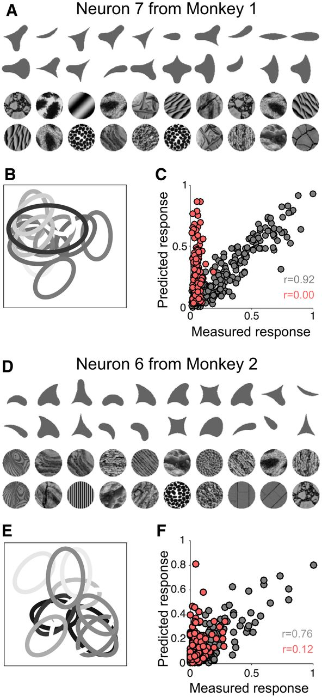
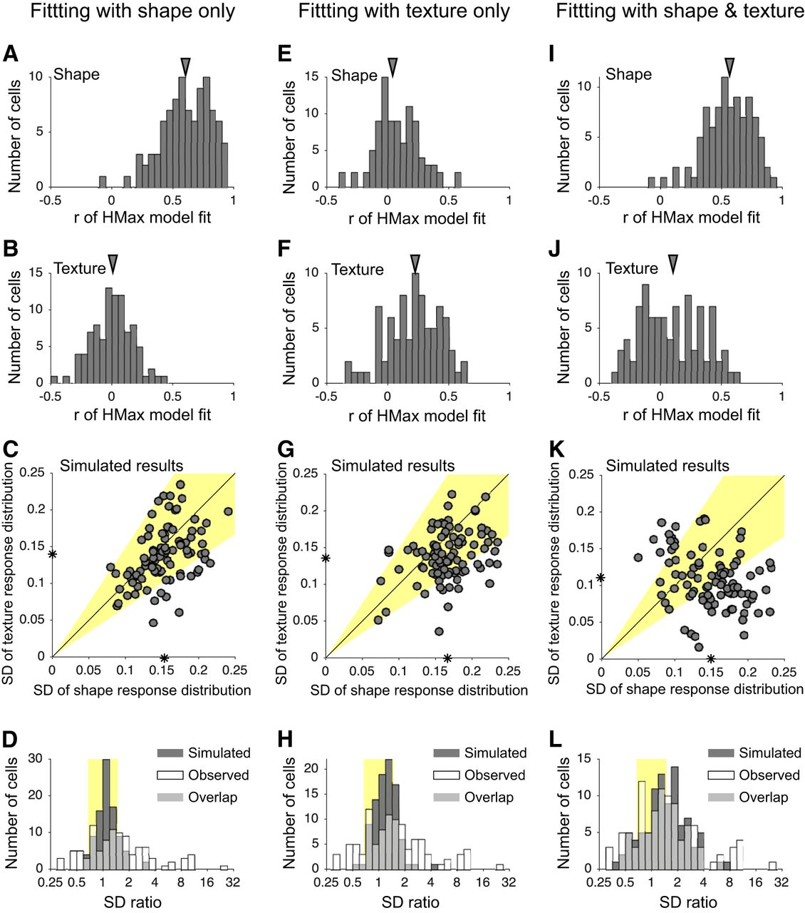
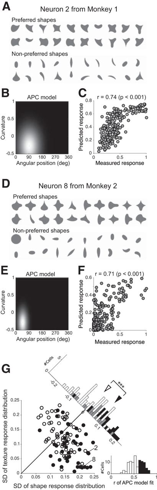
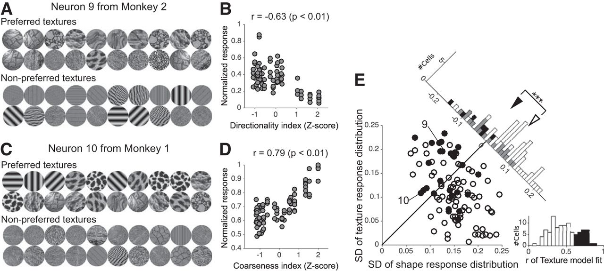
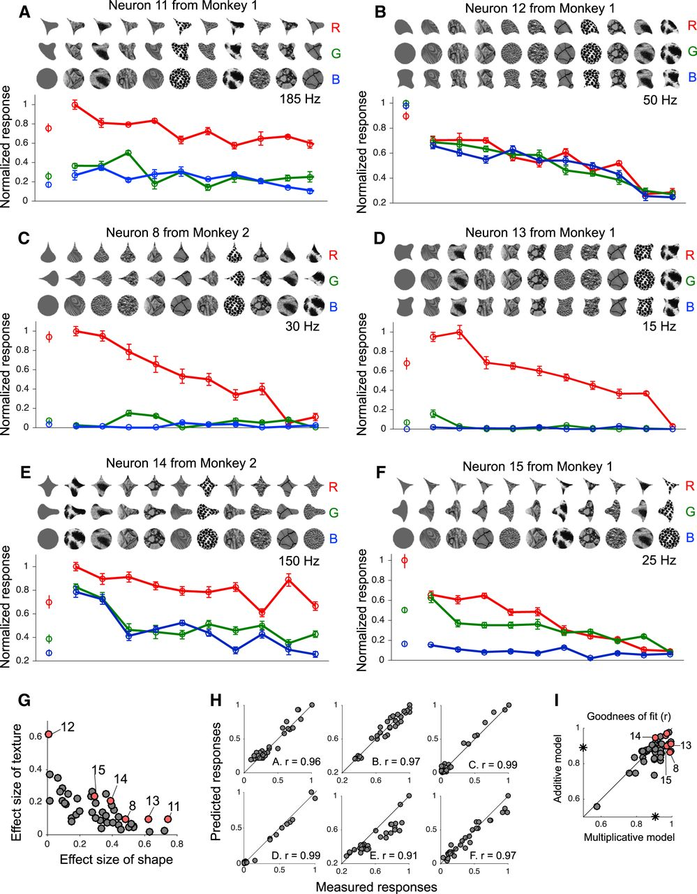
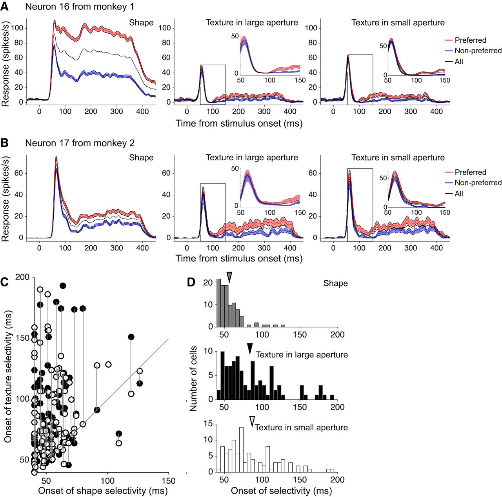

## Article info
|                    |                                                |
|--------------------|------------------------------------------------|
| `Authors`          | Taekjun Kim, Wyeth Bair, Anitha Pasupathy      |
| `Publication date` | 2019/06/12                                     |
| `Journal`          | Journal of Neuroscience                        |
| `DOI`              | https://doi.org/10.1523/JNEUROSCI.3073-18.2019 |

## Abstract
The distinct visual sensations of shape and texture have been studied separately in cortex; therefore, it remains unknown whether separate neuronal populations encode each of these properties or one population carries a joint encoding. We directly compared shape and texture selectivity of individual V4 neurons in awake macaques (1 male, 1 female) and found that V4 neurons lie along a continuum from strong tuning for boundary curvature of shapes to strong tuning for perceptual dimensions of texture. Among neurons tuned to both attributes, tuning for shape and texture were largely separable, with the latter delayed by ∼30 ms. We also found that shape stimuli typically evoked stronger, more selective responses than did texture patches, regardless of whether the latter were contained within or extended beyond the receptive field. These results suggest that there are separate specializations in mid-level cortical processing for visual attributes of shape and texture. 

## Figures
### Fig1. Visual stimuli

Visual stimuli. **A**, Shape stimuli. We used a subset (30 of 51) of the 2D shapes developed by Pasupathy and Connor (2001) to study how boundary conformation influences V4 responses. Most shapes were presented at 8 rotations (45° increments); a few shapes (those identified with a superscript) were presented at fewer rotations (1, 2, or 4, as noted in figure) due to rotational symmetry. The circle was presented at three luminance contrast levels (1, 16, 46 cd/m2) relative to the background (8 cd/m2), for a total of 225 shape stimuli. **B**, Texture stimuli. We constructed eight (23) texture categories based on three dimensions that influence human texture perception (coarse vs fine, directional vs nondirectional, regular vs irregular), and selected 2–3 representative textures for each category (see Materials and Methods). Each texture was presented through a circular aperture of two sizes and at four orientations at 45° increments, for a total of 168 texture stimuli. **C**, Examples of shape, large aperture texture, and small aperture texture stimuli. All parts of the shape stimulus were within the estimated RF region (yellow dotted line). The diameter of the large aperture texture stimuli was twice that of the estimated RF. Small aperture texture condition was created by applying a RF sized circular aperture to large aperture texture.

### Fig2. Example neurons and population results

**A**, Response frequency histogram for shape (top row) and texture (bottom row) stimuli for 6 example neurons (columns). Red and blue histograms represent responses to small and large aperture textures, respectively. Responses for each neuron were normalized to the maximum across all shape and texture stimuli (maximum values are shown for each neuron). Triangles represent the background responses (no visual stimulus). **B**, Maximum response across all shape stimuli (x axis) is plotted against the maximum response across all small aperture texture stimuli (y axis) for each neuron from Monkey 1 (black) and Monkey 2 (gray). Filled symbols represent neurons with a statistically significant difference between the strongest shape and texture response, assessed with a permutation test (see Materials and Methods). In both monkeys, the maximum response across shape stimuli was typically greater than the maximum response across texture stimuli. **C**, SD of the response frequency histogram for shape (x axis) is plotted against that for texture stimuli (y axis). Asterisks indicate mean value. Yellow highlight represents region where SD ratio for shape versus texture lies between 2/3 and 3/2. Points corresponding to examples in A are identified. **D**, Histogram of the SD ratio: SDshape/SDtexture. Yellow highlight as in **C**. **E, F**, SD values for shuffled shape and texture responses. Shape and texture responses for each neuron were shuffled and SDs were recomputed for two randomly divided groups: Group 1 (N = 225, number of shapes) and Group 2 (N = 84, number of textures).**F**, Gray bars represent SD ratios computed from E. This process was repeated 10,000 times and width of the distribution from the observed data, quantified by the interquartile range of log (SD ratio), was always at least 5 times broader than that from the shuffled data.

### Fig3. HMax model prediction of responses to texture stimuli

**A**, The top 20 preferred shape and texture stimuli of an example neuron (#7). **B**, Shape template for the S2 unit corresponding to the best fitting HMax model based on the responses to shape stimuli. Each ellipse indicates position, orientation, and size of complex-cell like subunit (C1 unit). Grayscale represents weighting strength with darker color denoting stronger weight. **C**, Predicted responses (y axis) based on the best HMax model fit (shown in **B**) for shape (gray) and texture (red) stimuli are plotted against measured responses (x axis). For this neuron, the HMax model provided an excellent fit for shape responses, but not for texture responses. Predicted texture responses showed a much broader range than the observed data. **D–F**, The results from another example neuron. The same conventions as in **A–C**.

### Fig4. SD ratios from HMax model prediction

**A–D**, Population results for HMax models optimized based on shape responses only. Model goodness of fit for shape (**A**) and texture (**B**) responses across all neurons. Goodness of fit was determined as the median correlation coefficient (r) of 10-fold cross-validation test sets. Triangles represent median. HMax models provided a good fit for shape responses (median r = 0.61) but a poor fit for the texture responses (median r = 0.02). Predicted response ranges (SD values) for shape and texture stimuli were similar (**C**), and the SD ratios (gray bars in **D**) spanned a narrow range. SD ratios from the observed data (as in Fig. 2D) are overlaid in white (**D**) for comparison. **D**, Light gray bars represent overlap between gray and white distributions. White bars are all the same in **D, H, L**. Yellow shaded area as in Figure 2. E–H, HMax model results optimized based on texture responses only. HMax models provided a poor fit for both shape (median r is 0.07) and texture (median r is 0.23) responses. Model results in terms of SD values and ratios (**G, H**) were similar to those in **C, D**. **I–L**, HMax models optimized simultaneously based on shape and texture responses. Models provided a good fit for shape responses (median r = 0.56) but a poor fit for texture responses (median r = 0.10). In this case, the distribution of SD ratios were similar to V4 data (compare gray and white bars in **L**), but the SDs for predicted texture responses were unlike observed data: note the lack of low (<0.05) and high (>0.2) SDs for texture in K compared with Figure 2C. Asterisk indicate mean value.

### Fig5. Tuning for boundary curvature in shape-selective neurons

**A**, Shape stimuli that evoked the strongest (preferred) and weakest (nonpreferred) responses from an example neuron (#2; also in Fig. 2). For this neuron, shapes evoked a broader range of responses than textures: SD for shape = 0.23; SD for texture = 0.07. **B**, Responses to shape stimuli were best explained by a 2D Gaussian APC model with a peak at a curvature of −0.27 at 90°, reflecting the preference for concave curvature to the top of the shape. **C**, Responses predicted by the best fit APC model (y axis) are well correlated with the observed responses. **D–F**, Results from a second example neuron (#8). The same conventions as in **A–C**. This neuron responded strongly to shapes with a concave contour at top right of the shape (45°). SD for shape = 0.22; SD for texture = 0.02. **G**, Neurons whose responses are well predicted by the APC model (filled symbols, APC model goodness of fit > 0.6) are identified on a scatter plot of response range for shape and texture stimuli (same as Fig. 2C). This included 42 of 101 neurons across our dataset (right, histogram). Top right, Histogram represents the distribution of SD differences (shape − texture) for highly shape-selective (black bars) and other neurons (white). Mean SD shape minus SD texture was significantly different for the two groups of neurons (Mann–Whitney U test, p < 0.001). Triangles represent median values of the distributions. Gray bars represent overlap between two distributions. Data points corresponding to the example neurons in **A–C** (#2), and **D–F** (#8) are identified. Asterisks indicate that difference between two distributions are statistically significant at the level of p < 0.001 (Mann-Whitney U-test).

### Fig6. Tuning for perceptual dimension of texture

**A**, Texture stimuli that evoked the strongest (preferred) and weakest (nonpreferred) responses from an example neuron (#9). The nonpreferred textures are directional, oriented at different directions, unlike the preferred stimuli, which tend to be nondirectional for this neuron. SD for shape = 0.13; SD for texture = 0.20. **B**, Neural responses for all texture stimuli (y axis) plotted as a function of the directionality index (x axis) shows a statistically significant (p < 0.001) negative correlation. **C, D**, Example neuron (#10) that responded strongly to coarse rather than fine textures. SD for shape = 0.08; SD for texture = 0.11. **E**, Neurons whose responses are well predicted by the texture model (see Materials and Methods; filled symbols, texture model goodness of fit > 0.6) are identified on the scatter plot of response range for shape and texture stimuli. This included 27 of 101 neurons across our dataset (right, histogram). These texture-selective neurons (filled circles) and the other neurons (open circles) showed a significant difference in distribution of shape SD minus texture SD (Mann–Whitney U test, p < 0.001; see top right, histogram). Triangles represent median values of the distributions. There was limited overlap (n = 6) between neurons with APC model goodness of fit > 0.6 and those with texture model goodness of fit > 0.6 (compare filled symbols in Fig. 5G vs Fig. 6E). Data points corresponding to the example neurons in **A** and **B** (#9), and **C** and **D** (#10) are identified.

### Fig7. Joint coding of shape and texture

**A**, Responses of an example neuron (#11) to 10 nondirectional textures (x axis) presented through three different shapes apertures (line colors). Responses to the three shapes presented with a uniform luminance contrast are also shown (leftmost symbols) for comparison. Error bars indicate ±1 SEM. This neuron exhibited a broader range of shape responses than texture responses (SD for shape = 0.19, SD for texture = 0.10), but overall, shape preference was largely preserved across textures. **B**, Example neuron (#12) with a strong preference for texture but not shape (SD for shape = 0.07, SD for texture = 0.16). All details as in **A**. **C**, Neuron 8 showed selectivity along shape and texture dimensions. Preference for fine textures was observable only within the preferred shape boundary. **D–F**. Additional example neurons (#13, #14, #15) that exhibited joint tuning for shape and texture. **G**, Effect size (see Materials and Methods) of texture was compared with that of shape for each of 43 neurons subjected to the control experiment. Data points corresponding to the example neurons (**A–F**) are identified. **H**, To quantify the independence of shape and texture tuning, we evaluated whether responses to shape-texture combination stimuli can be predicted by the product of the responses to shape and texture. Scatter plots show observed responses versus those predicted by a multiplicative model (see Materials and Methods) for neurons in **A–F**. **I**, Comparison between multiplicative (x axis) model and additive (y axis) model. Goodness-of-fit (r) values were quantified by the correlation coefficient between observed and predicted responses across all neurons (n = 43). Multiplicative model (median r = 0.91) generally provides a better fit than an additive model (median r = 0.86). Asterisk indicate median value.

### Fig8. Temporal dynamics of shape and texture selectivity

**A**, PSTHs for shape (left), large and small aperture textures (middle and right, respectively) are shown for preferred (red; top 50% of stimuli based on spike counts between 50 and 400 ms after stimulus onset; see Materials and Methods), nonpreferred (blue; bottom 50%), and all stimuli (black) for one example neuron. Shaded area represents ±1 SEM. For shape stimuli, difference in responses between preferred and nonpreferred stimuli emerged soon (50 ms) after response onset. For textures, statistically significant difference emerged at 100 ms after stimulus onset. **B**, Second example neuron showing delayed emergence of texture selectivity (shape-dependent modulation ≥ 51 ms; texture-dependent modulation ≥ 88 ms; earlier onset was determined for small aperture texture condition). **C**, Across all neurons, onset of shape selectivity (x axis) is plotted against onset of texture selectivity (y axis). Filled and open symbols represent large and small aperture conditions, respectively. Data points from the same neuron are connected by a vertical line. In a few neurons (data points without vertical line), onset of texture selectivity could not be defined for one of the aperture conditions due to weak responses. Most data points lie above the diagonal line, indicating that texture information is processed later than shape information. **D**, Marginal histograms for onset times for shape (gray), large aperture texture (black), and small aperture texture (white). Triangles represent the mean of each distribution (shape = 55.72 ms, large aperture texture = 85.53 ms, small aperture texture = 85.78 ms). On average, onset of shape selectivity was ∼30 ms faster than onset of texture selectivity.

