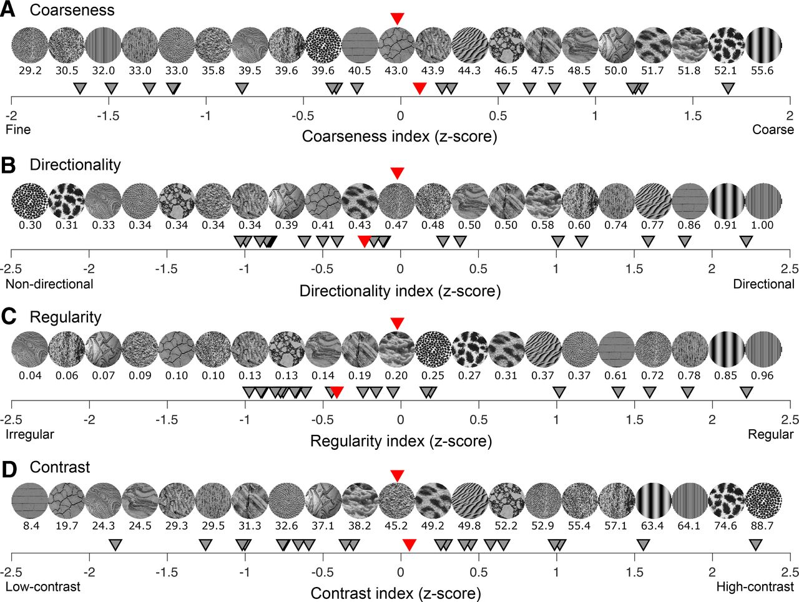
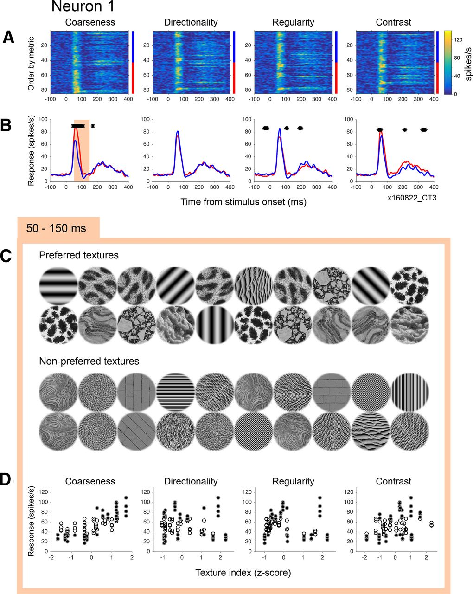
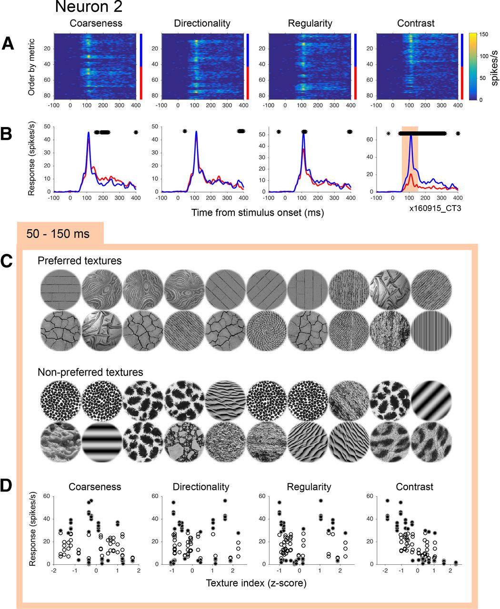
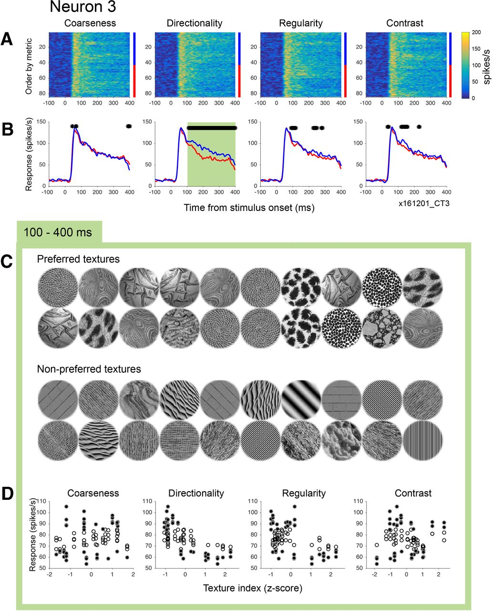
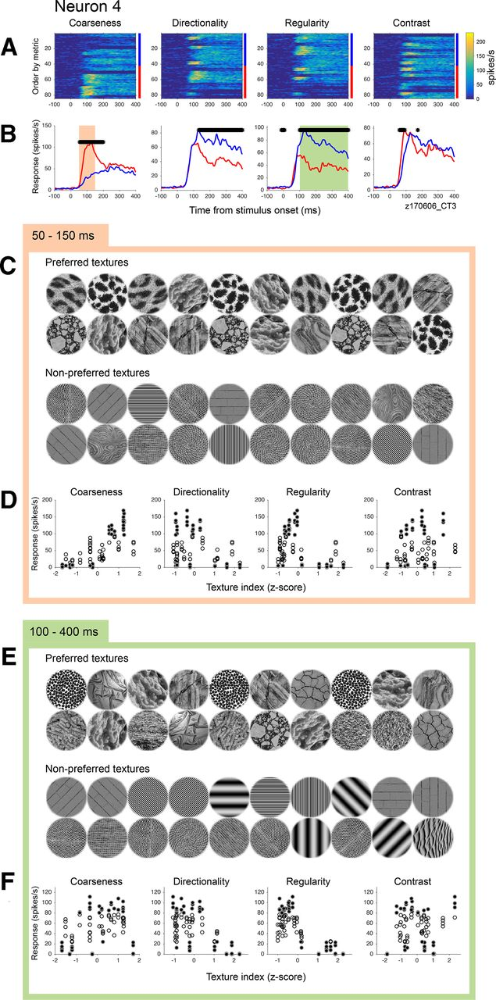
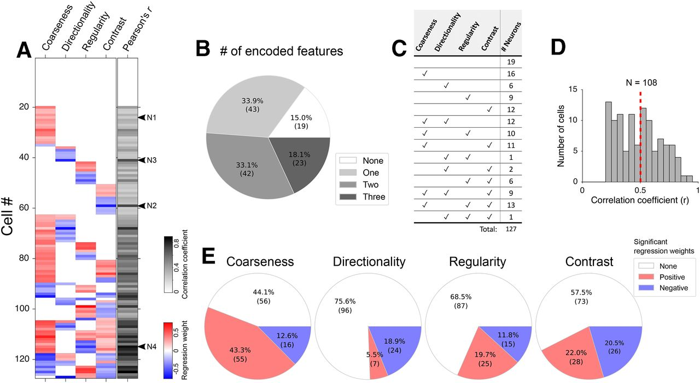
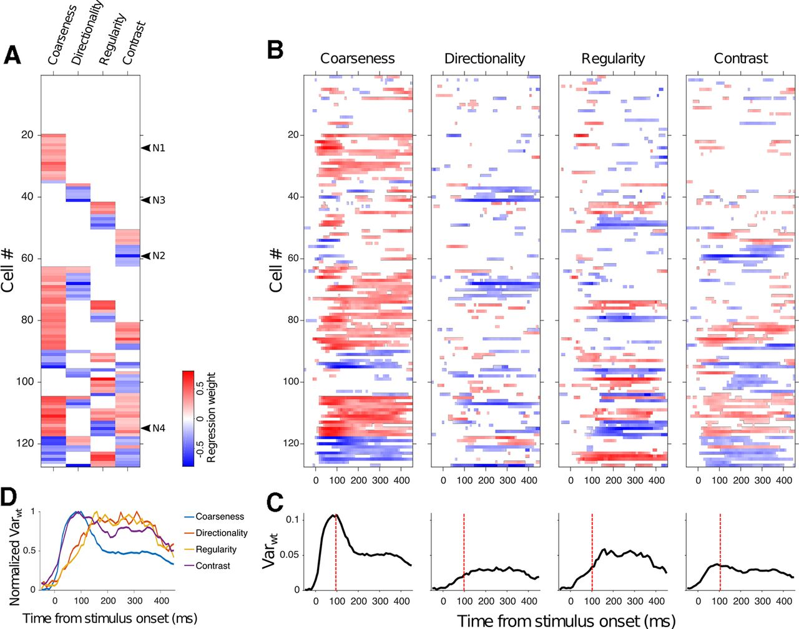
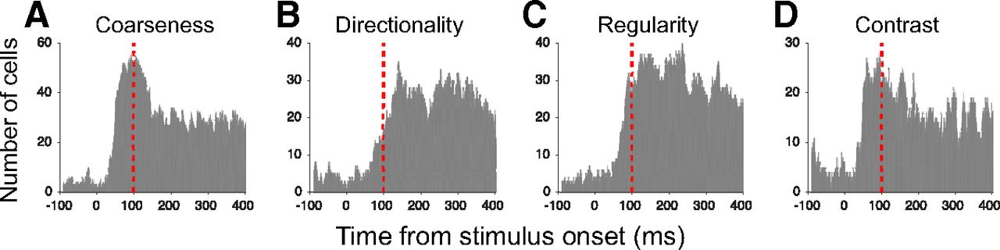
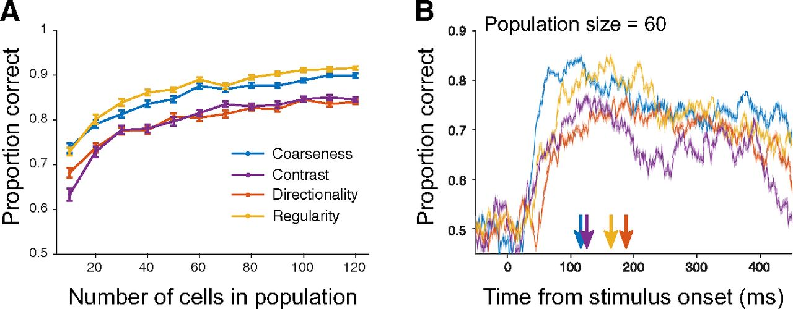

## Article info
|                    |                                                |
|--------------------|------------------------------------------------|
| `Authors`          | Taekjun Kim, Wyeth Bair, Anitha Pasupathy      |
| `Publication date` | 2022/01/26                                     |
| `Journal`          | Journal of Neuroscience                        |
| `DOI`              | https://doi.org/10.1523/JNEUROSCI.0971-21.2021 |

## Abstract
Texture is an important visual attribute for surface pattern discrimination and therefore object segmentation, but the neural bases of texture perception are largely unknown. Previously, we demonstrated that the responses of V4 neurons to naturalistic texture patches are sensitive to four key features of human texture perception: coarseness, directionality, regularity, and contrast. To begin to understand how distinct texture perception emerges from the dynamics of neuronal responses, in 2 macaque monkeys (1 male, 1 female), we investigated the relative contribution of the four texture attributes to V4 responses in terms of the strength and timing of response modulation. We found that the different feature dimensions are associated with different temporal dynamics. Specifically, the response modulation associated with directionality and regularity was significantly delayed relative to that associated with coarseness and contrast, suggesting that the latter are fundamentally simpler feature dimensions. The population of texture-selective neurons could be grouped into multiple clusters based on the combination of feature dimensions encoded, and those subpopulations displayed distinct temporal dynamics characterized by the weighted combinations of multiple features. Finally, we applied a population decoding approach to demonstrate that texture category information can be obtained from short temporal windows across time. These results demonstrate that the representation of different perceptually relevant texture features emerge over time in the responses of V4 neurons. The observed temporal organization provides a framework to interpret how the processing of surface features unfolds in early and midlevel cortical stages, and could ultimately inform the interpretation of perceptual texture dynamics. 

## Figures
### Fig1. Visual stimuli

We used a set of 21 textures to study responses of V4 neurons. The ordering of textures along the four dimensions is shown: (**A**) coarseness, (**B**) directionality, (**C**) regularity, and (**D**) contrast. Along each axis, textures are rank-ordered; in A from fine to coarse, etc. Numbers below each texture image indicate the raw index value along each axis. Gray triangles represent the corresponding z-scored value. Red triangles represent the median texture and the corresponding z-scored value along each axis. Each texture was presented in four orientations for a total of 84 stimuli (see Materials and Methods).

### Fig2. Example neuron selective for coarse textures

**A,** PSTHs are shown for the 84 texture stimuli. All panels represent the same data but differently ordered in accordance with the rank-ordering in Figure 1 (i.e., in ascending order of the index value along each of the four texture dimensions). From top to bottom for each panel, textures run from fine to coarse, nondirectional to directional, irregular to regular, and low-contrast to high-contrast, respectively. Color represents response strength in accordance with the scale bar. Responses are smoothed with a Gaussian of σ = 5 ms. 
**B,** Average PSTHs for the top and bottom halves along each texture dimension are shown in blue and red, respectively. For example, in the first panel at left, blue and red represent responses to fine and coarse textures, respectively. Black asterisks indicate time points with significant difference between red and blue curves (Mann–Whitney U test in a 30 ms sliding window, p < 0.05). Statistically significant difference between responses to coarse and fine textures emerged 41 ms after stimulus onset. 
**C,** The 20 most (top) and least (bottom) preferred textures based on the number of spikes during the 50-150 ms window after stimulus onset (shading in B) are shown. 
**D,** Scatter plots represent neuronal responses to all texture stimuli during the 50-150 ms window as a function of each texture index. Filled symbols represent the 20 preferred and nonpreferred textures shown in **C**.

### Fig3. Example neuron selective for texture contrast

Low-contrast textures evoked stronger responses from Neuron 2 compared with high-contrast textures (**A,B,** rightmost panels). Statistically significant difference between responses to low- and high-contrast textures emerged 43 ms after stimulus onset. A mild preference for coarse textures is notable later in the response. All conventions are as in Figure 2. **C,** The 20 most and least preferred textures are shown based on the number of spikes during the 50-150 ms window after stimulus onset (shading in B). **D,** Scatter plots represent neuronal responses to all texture stimuli during the 50-150 ms window as a function of each texture index. Filled symbols represent the 20 preferred and nonpreferred textures shown in **C**.

### Fig4. Example neuron selective for nondirectional textures

**A, B,** Textures lacking directional information evoked stronger responses from Neuron 3. Statistically significant difference between responses to nondirectional and directional textures emerged 109 ms after stimulus onset. **C,** The 20 most and least preferred textures are shown based on the number of spikes during the 100-400 ms window after stimulus onset (shading in B). All conventions are as in Figure 2. **D,** Scatter plots represent neuronal responses to all texture stimuli during the 100-400 ms window as a function of each texture index. Filled symbols represent the 20 preferred and nonpreferred textures shown in **C**.

### Fig5. Example neurons selective for multiple texture features

**A, B,** Coarse and irregular textures evoke strong responses from Neuron 4. Statistically significant difference between responses to coarse and fine textures emerged 52 ms after stimulus onset, whereas that between regular and irregular textures emerged later, at 100 ms. Statistically significant difference in response between directional and nondirectional textures is also evident, but this can be explained by the correlation between directionality and regularity in our stimulus set (see Results). **C-F,** Scatter plots show mean neuronal responses to all texture stimuli during the 50-150 ms (**D**) or 100-400 ms (**F**) epoch after stimulus onset as a function of each texture index. The 20 most and least preferred textures based on early activity (**C**) and later activity (**E**) are shown. All conventions are as in Figure 2.

### Fig6. Population results: relative contribution of different texture attributes

**A,** Fitted weights for the four texture attributes based on the stepwise regression analysis for individual neurons are shown (see Materials and Methods). Models were based on neuronal responses in the 50-400 ms window after stimulus onset. Red and blue represent positive and negative weights, respectively (see color bar). Grayscale represents goodness of fit in terms of the correlation coefficient (Pearson's r) between the observed and predicted responses for each neuron. Neurons (N1-N4) corresponding to examples in Figure 2-5 are identified. **B,** Pie plot represents relative proportions (and numbers) of neurons encoding single or multiple texture features based on the number of coefficients deemed significant in the stepwise regression model. **C,** Tabulation of the frequency of the different combinations of feature dimensions that provided the best fit for neuronal responses based on the regression models. **D,** Distribution of goodness-of-fit values quantified by the correlation coefficient (r) between the observed and predicted data values from the 108 neurons with a statistically significant stepwise regression fit. Red dashed line indicates the median value, 0.50. **E,** The relative proportions of positive and negative weights for each texture attribute.

### Fig7. Population results: temporal dynamics of the stepwise regression fit

**A,** The fitted weights for the four attributes based on the stepwise regression model fit for individual neurons. Models were based on neuronal responses in the 50-400 ms window after stimulus onset (same as in Fig. 6A). **B,** Weights as a function of time for the four texture attributes based on the stepwise regression fit. Models were based on neuronal responses within a 100 ms sliding window from –100 to 500 ms sliding in 10 ms increments. Red and blue represent positive and negative weights, respectively. **C,** Variance in texture weights across neurons (Var_wt) is shown as a function of time for each of the four texture dimensions. High values of Varwt are an indicator of the emergence of selectivity. **D,** Var_wt, normalized by the maximum across texture attributes, is plotted to facilitate direct comparison of the temporal dynamics. Varwt for coarseness and contrast rose rapidly and reached the maximum values no later than 100 ms after stimulus onset, whereas those for directionality and regularity evolved more slowly and reached the maximum values at ∼150 ms after stimulus onset.

### Fig8. Temporal dynamics: the frequency of significantly modulated neurons

**A-D,** The number of significantly modulated neurons as a function of time for each texture dimension. Red lines at 100 ms after the stimulus onset are included to facilitate comparison across panels.

### Fig9. Decoding of texture category from population responses

**A,** Decoding accuracy of SVM classifiers for each of the four texture dimensions is plotted as a function of population size. At each size, neurons were sampled with replacement to generate a simulated subpopulation, and an SVM was trained to assign each texture to one of two categories along each texture dimension (e.g., coarse vs fine) based on spiking responses during the 50-400 ms window after stimulus onset. The simulation was repeated 100 times, and the average cross-validation scores were obtained for each texture dimension. Error bars indicate SEM. **B,** Time course of SVM classifier performance was quantified using a sliding window (bin width: 30 ms, step size: 1 ms) for a population size of 60 neurons. The simulation was repeated 100 times, and the average cross-validation scores were obtained for each texture dimension. Shaded area represents ± 1 SEM. Arrows indicate the peak proportion correct for each curve.
