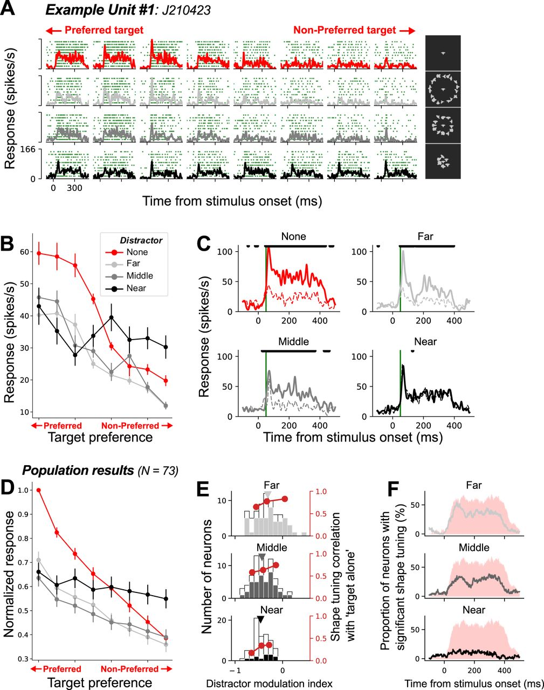

## Article info
|                    |                                                |
|--------------------|------------------------------------------------|
| `Authors`          | Taekjun Kim, Anitha Pasupathy                  |
| `Publication date` | 2024/06/12                                     |
| `Journal`          | Journal of Neuroscience                        |
| `DOI`              | https://doi.org/10.1523/JNEUROSCI.2260-23.2024 |

## Abstract
Visual crowding refers to the phenomenon where a target object that is easily identifiable in isolation becomes difficult to recognize when surrounded by other stimuli (distractors). Many psychophysical studies have investigated this phenomenon and proposed alternative models for the underlying mechanisms. One prominent hypothesis, albeit with mixed psychophysical support, posits that crowding arises from the loss of information due to pooled encoding of features from target and distractor stimuli in the early stages of cortical visual processing. However, neurophysiological studies have not rigorously tested this hypothesis. We studied the responses of single neurons in macaque (one male, one female) area V4, an intermediate stage of the object-processing pathway, to parametrically designed crowded displays and texture statistics-matched metameric counterparts. Our investigations reveal striking parallels between how crowding parameters—number, distance, and position of distractors—influence human psychophysical performance and V4 shape selectivity. Importantly, we also found that enhancing the salience of a target stimulus could alleviate crowding effects in highly cluttered scenes, and this could be temporally protracted reflecting a dynamical process. Thus, a pooled encoding of nearby stimuli cannot explain the observed responses, and we propose an alternative model where V4 neurons preferentially encode salient stimuli in crowded displays. Overall, we conclude that the magnitude of crowding effects is determined not just by the number of distractors and target–distractor separation but also by the relative salience of targets versus distractors based on their feature attributes—the similarity of distractors and the contrast between target and distractor stimuli. 

## Figures
### Fig1. Visual stimulus design

**A**, Tabulation of clutter conditions. For each target–distractor configuration (rows), responses to eight target rotations (# Conditions = 8) were evaluated, except when distractors were presented without a target (Target = None). An open circle under Metamer column indicates that metameric stimuli were also presented (see Materials and Methods). 
**B**, Shape stimulus set. Target (red box) and distractor shapes were chosen from a set of 2D shapes [a subset of shapes created by Pasupathy and Connor (2001)]. Target stimulus was at the RF center, scaled to half of the estimated RF diameter. 
**C**, The target stimulus was presented either (i) alone or in combination with various distractor arrangements which varied in terms of (ii) distance from central target, (iii) number, (iv) saliency defined by target color, and (v) shape, shape + size of distractors. In all conditions, the target shape was shown at eight rotations in 45° increments (as in i). Targets were achromatic or chromatic when presented alone. In all clutter conditions targets were achromatic except when target saliency was titrated by color (iv). Distractors were always achromatic. The target size was the same in all conditions, but it is scaled down in ii for illustration purposes. Distractors were the same size as target except when titrating saliency by size (yellow dot). Metameric stimulus pairs with matched texture statistics (in vi: panels 1–2, 3–4, and 5–6) were included to test the texture-pooling model (see Materials and Methods). Colored dots in A and C identify identical stimulus conditions repeated in the figure for illustration purposes.

### Fig2. Effect of target–distractor distance on shape tuning

**A–C**, Example neuron. 
**A**, Raster plots and PSTHs for responses to (rows) target alone, target + far, middle, and near distractor conditions, respectively. Columns show responses to different target orientations, rank-ordered by responses to target-alone. Stimulus panels are shown here at a higher contrast to aid visibility (see Fig. 1C for veridical illustration). 
**B**, Tuning curves based on average responses (0–400 ms) for the four target + distractor conditions. Error bars indicate the standard error of the mean. 
**C**, Average PSTHs for the preferred (top 4) and nonpreferred (bottom 4) targets for each distractor condition are shown in solid and dotted lines, respectively. Black asterisks indicate time points with significant difference between solid and dotted curves (Mann–Whitney U test in a 30 ms sliding window; p < 0.05). **D–F**, Population results. 
**D**, Average normalized tuning curves across the subpopulation of neurons with significant shape selectivity in the target alone condition (73/147). Error bars indicate the standard error of the mean. 
**E**, The distribution of distractor modulation index (DMI) for each distractor condition is presented. Filled bars represent neurons whose shape tuning curve exhibited statistically significant correlations with that in the “target alone” condition. Red symbols denote the mean correlation values in neurons within the lower (0–50%), middle (25–75%), and upper (50–100%) ranges of the DMI distribution. 
**F**, The proportion of neurons with significant shape-dependent modulation (i.e., asterisks in C) as a function of time for each distractor condition. The red shaded area, representing the equivalent analysis for the “target alone” condition, is included for panel-to-panel comparison.

### Fig3. Effect of distractor number on responses and selectivity

**A–C**, Example neuron responses. 
**A**, Raster plots with PSTHs for responses to (rows) target alone, target + 1, 3, or 6 distractors, respectively. Columns show responses to different target orientations. 
**B**, Target shape selectivity curves of the example unit for the four different conditions. 
**C**, Average PSTHs for the preferred (top 4) and nonpreferred (bottom 4) targets. 
**D–F**, Population results. 
**D**, Average normalized tuning curves for target shape selectivity in the presence and absence of distractors. 
**E**, The distribution of distractor modulation index (DMI) for each distractor condition is presented. Filled bars represent neurons whose shape tuning curve exhibited statistically significant correlations with that in the “target alone” condition. Red symbols denote the mean correlation values in neurons within the lower (0–50%), middle (25–75%), and upper (50–100%) ranges of the DMI distribution. 
**F**, The proportion of neurons with significant shape-dependent modulation (i.e., asterisks in C) as a function of time for each distractor condition. All conventions are as in Figure 2.

### Fig4. Effects of distractor position on visual crowding: anisotropic crowding zone

**A, B**, RF summary illustrates both location (**A**) and size (**B**). RFs from two monkeys are positioned in the lower right visual field and their sizes increase with eccentricity. Red line in B denotes the values computed using the equation employed to estimate the RF diameter (see Materials and Methods). 
**C**, For each neuron, the positions of the distractors were transformed into a radial/tangential axis relative to the fixation point. The yellow circles depict two example RF locations. The red, green, and blue arrows indicate the radial outward, radial inward, and tangential directions with respect to the target location. 
**D**, The histograms illustrate the correlation between tuning curves for target alone versus target + one distractor calculated at 12 distractor positions, which were realigned based on the radial and tangential axes originating from the fixation point. Filled bars indicate statistically significant cases. In the polar plot, red and black data points compare the median values (red vertical lines) and proportion of significant cases (filled bars) from histograms of the matched directions, respectively. 
**E**, RF shape estimation from four example neurons. A 2D Gaussian fit (white ellipses) is superimposed on the raw response map (7 × 7 grid, 1° intervals). Theta angle represents the counterclockwise angle of the major axis of RF with respect to the horizontal line. Red and blue dots indicate Gaussian fit center and RF hotspot, respectively. 
**F**, Distribution of the major axis orientation in the Gaussian RF fitting of the recorded neurons. Red vertical line indicates the median value. For the RFs in the lower right visual field, an angle bigger than 90° represents an elongated RF shape oriented toward the fixation point. 
**G**, In most neurons, the RF hotspot (y-axis) is closer to the fixation point than the center of the 2D Gaussian fit (Wilcoxon signed-rank test; p < 0.05), suggesting that the RF extent is larger in the outward radial direction compared with the inward direction. The red line represents the unity line.

### Fig5. Effects of target saliency (color cue) on visual crowding

Target (gray or colored) appeared alone or in combination with six random distractors. 
**A–C**, Example unit responses. 
**A**, Raster plots with PSTHs. 
**B**, Target shape selectivity curves of the example unit for the four different conditions. 
**C**, Average PSTHs for the preferred (top 4) and nonpreferred (bottom 4) targets. 
**D–F**, Population results. 
**D**, Average normalized tuning curves for target shape selectivity across conditions. 
**E**, The distribution of distractor modulation index (DMI) for each distractor condition. Filled bars represent neurons whose shape tuning curve exhibited statistically significant correlation with that in the “target alone” condition. Red symbols denote the mean correlation values for neurons within the lower (0–50%), middle (25–75%), and upper (50–100%) ranges of the DMI distribution. 
**F**, The proportion of neurons with significant shape-dependent modulation as a function of time for each distractor condition. All conventions are as in Figure 2.

### Fig6. Effects of target saliency (shape, size cues) on visual crowding

Target appeared alone or in combination with 12 small circles, six circles, or six random distractors. 
**A–C**, Example unit responses. 
**A**, Raster plots with PSTHs. 
**B**, Target shape selectivity curves of the example unit from four different conditions. 
**C**, Average PSTHs for the preferred (top 4) and nonpreferred (bottom 4) targets. 
**D–F**, Population results. 
**D**, Average normalized tuning curves for target shape selectivity across conditions. 
**E**, The distribution of distractor modulation index (DMI) for each distractor condition. Filled bars represent neurons whose shape tuning curve exhibited statistically significant correlation with that in the “target alone” condition. Red symbols denote the mean correlation values for neurons within the lower (0–50%), middle (25–75%), and upper (50–100%) ranges of the DMI distribution. 
**F**, The proportion of neurons with significant shape-dependent modulation as a function of time for each distractor condition. All conventions are as in Figure 2.

### Fig7. Test of texture statistics model

**A–C**, Test of the texture statistics model for visual crowding. 
**A**, For each neuron, we computed two correlations: (1) the correlation between responses to “target + random distractor” and “target alone” stimuli and (2) the correlation between responses to “target + random distractor” stimuli and matched metamers. Population data are shifted below the diagonal suggesting that responses to target + random distractors are better correlated with the “target alone” condition (x-axis). Cells with a significant correlation (p < 0.05) in x-axis alone, y-axis alone, or both are identified (see legend). 
**B, C**, The same analyses as in A for the “circle distractor” (**B**) and “small circle distractor” (**C**) conditions in which the target is more salient.

### Fig8. Temporal dynamics of population decoding

Population decoding performance plotted as a function of time across different distractor conditions. In all four panels, target alone (red) and target + 6 near distractors (black) are identical. Decoding performance declines in the presence of distractors but time course varies across conditions. For the salient target conditions (light blue curve in **C**, gray curves in **D**), rise time and the maximum decoding performance time are delayed compared with target alone conditions (red and blue curves in **C,D**), but this is not the case for distance and number effects (gray curves in **A,B**). Green line indicates the chance level of target orientation decoding (0.125, 1 out of 8). Different colored lines represent different target–distractor configurations.

### Fig9. Hierarchical saliency computation model

Visual input is first processed in parallel by a set of low-level feature detectors (e.g., orientation, color, luminance, texture) in earlier visual areas. To focus on the central region of the visual scene, visual inputs (112 × 112 pixels) and feature maps (28 × 28 pixels) were cropped from the larger images of size 224 × 224 pixels and 55 × 55 pixels, respectively. Feature maps show the outputs from the first five filters from AlexNet. The next stage of processing performs a RF center-surround operation for each feature dimension and selectively combines only informative feature maps in which the RF center region is more strongly activated than its surround (see more details in the main text).
