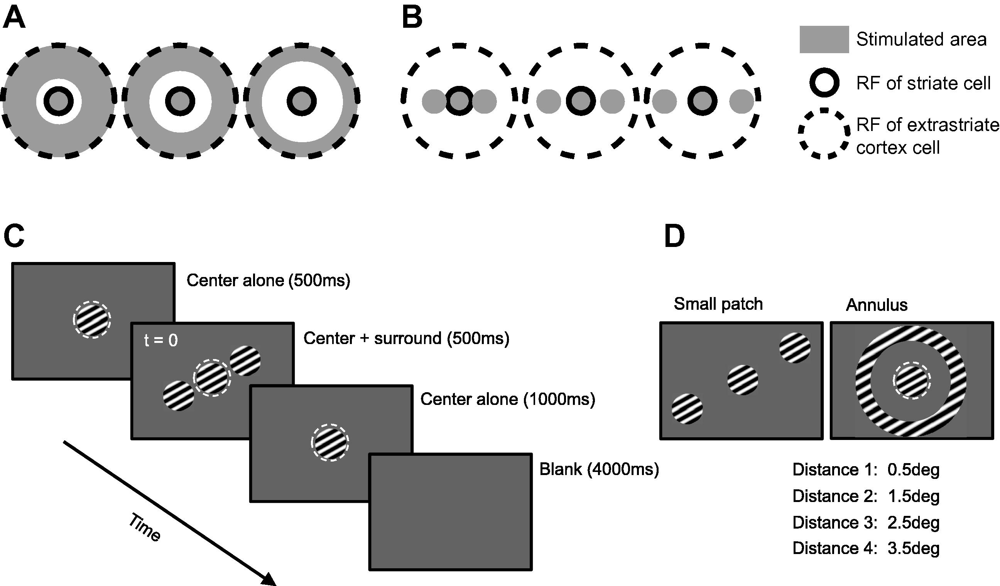
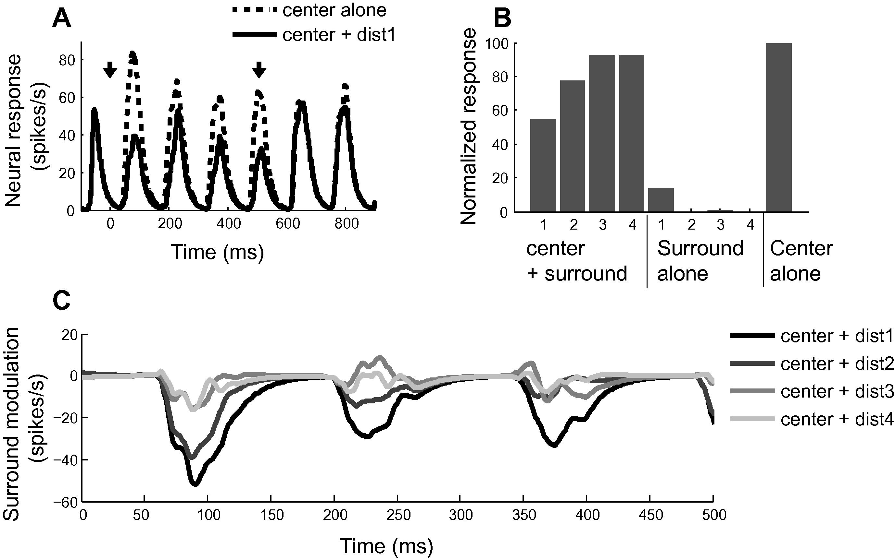
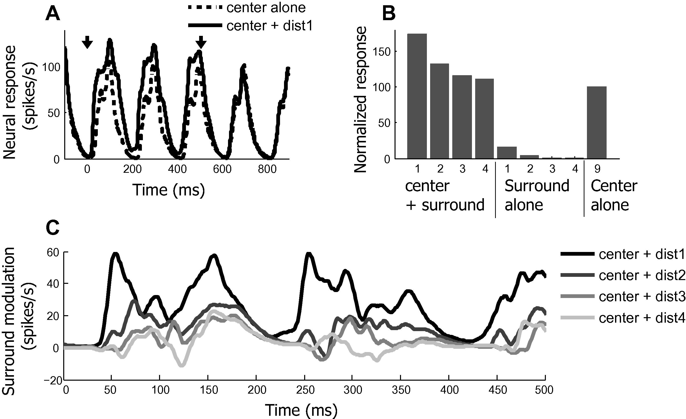
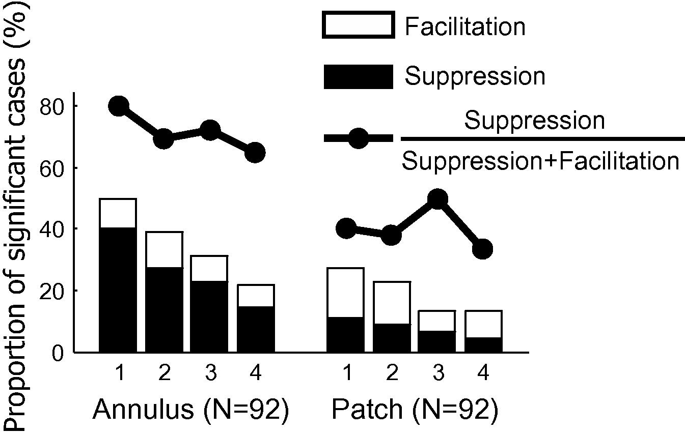
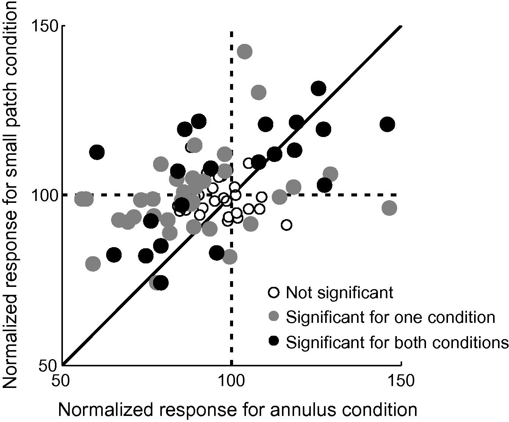
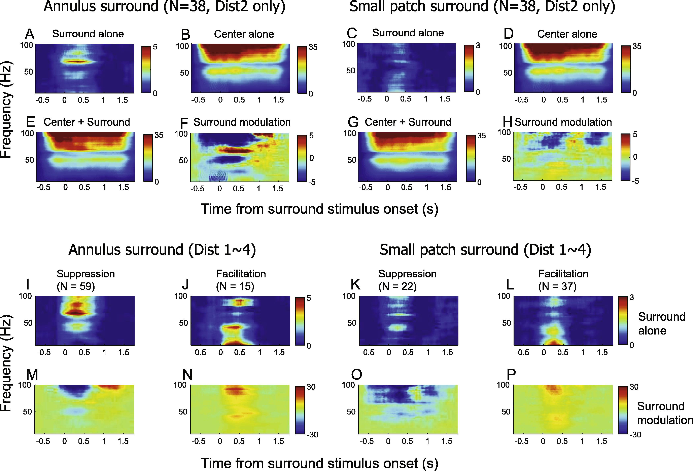
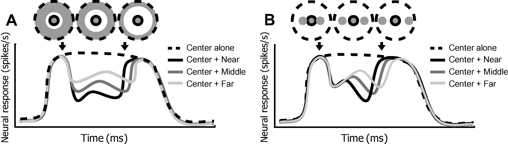
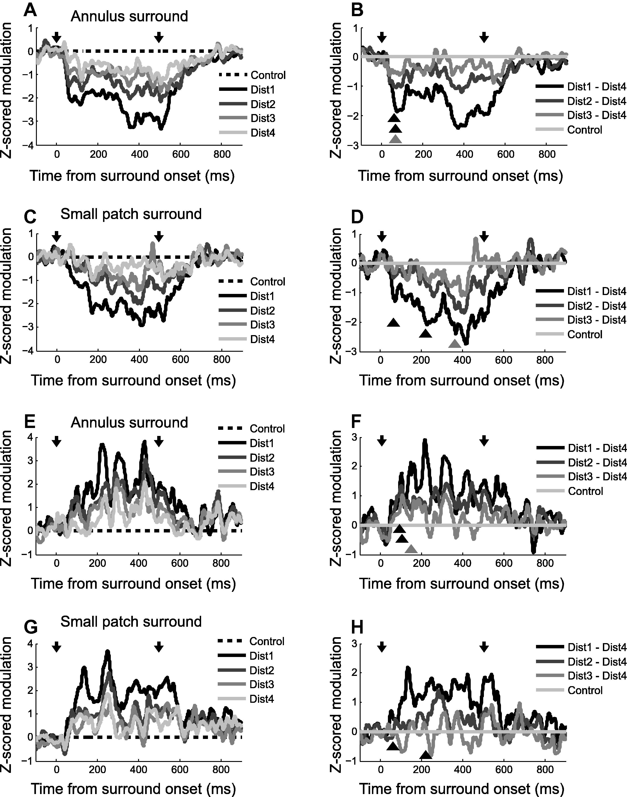

## Article info
|                    |                                                    |
|--------------------|----------------------------------------------------|
| `Authors`          | Taekjun Kim, Ralph D Freeman                       |
| `Publication date` | 2014/08/22                                         |
| `Journal`          | Neuroscience                                       |
| `DOI`              | https://doi.org/10.1016/j.neuroscience.2014.05.041 |

## Abstract
Organization of the central visual pathway is generally studied from a perspective of feedforward processes. However, there are horizontal connections and also strong feedback from extra striate to visual cortex. Here, we use visual stimuli designed to maximize relative differential involvements of these three main types of connections. The approach relies on differences between stimulation within the classical receptive field (CRF) and that of the surround region. Although previous studies have used similar approaches, they were limited primarily to spatial segregation of neural connections. Our experimental design provides clear segregation of fast and slow components of surround modulation. We assume these are mediated by feedback and horizontal connections, respectively, but other factors may be involved. Our results imply that both horizontal and feedback connections contribute to integration of visual information outside the CRF and provide suppressive or facilitative modulation. For a given cell, modulation may change in strength and sign from suppression to facilitation or the reverse depending on surround parameters. Sub-threshold input from the CRF surround increases local field potential (LFP) power in distinct frequency ranges which differ for suppression and facilitation. Horizontal connections have delayed CRF-surround modulation and are sensitive to position changes in the surround. Therefore, surround information beyond the CRF is initially processed by fast connections which we consider to be feedback, whereas spatially tuned mechanisms are relatively slow and presumably mediated by horizontal connections. Overall, results suggest that convergent fast (feedforward) inputs determine size and structure of the CRFs of recipient cells in visual cortex. And fast connections from extra striate regions (feedback) plus slow-tuned connections (horizontal) within visual cortex contribute to spatial influences of CRF surround activation. 

## Figures
### Fig1. Visual stimulus design

Two sets of center-surround (CRF-outside CRF) stimuli: annulus surround (left) and small patch surround (right). With both sets, distance between center and surround stimuli is systematically varied. In annulus surround pattern (**A**), annuli of different widths are used so that increments of center-surround distances are accompanied with decreases of total stimulated area. In small patch surround pattern (**B**), change of center-surround distance does not cause increase or decrease of total area stimulated. (**C**) Sequence of a trial. Optimal sinusoidal moving gratings are used to stimulate CRF and surround regions of a cell under study. The center (CRF) stimulus (2000-ms duration, 50% contrast) is presented first, followed by surround stimuli (500-ms duration, 100% contrast) after a 500-ms temporal interval. (**D**) Small-patch surround stimuli and annulus surround are tested in separate blocks. For small patch surround blocks, two-patch surround stimuli are positioned symmetrically with respect to the center stimulus along the axis of preferred orientation. Inter-patch distances (white arrows) are chosen randomly as one out of four values (0.5–3.5 deg, 1 deg step) for each trial. For annulus surround blocks, the outer diameter of the annulus is fixed at 30 deg. Therefore, four levels of center-surround distance are controlled by the inner diameter of the annulus. In addition to four “center + surround” and four “surround-alone” conditions, a “center-alone” presentation is tested as a control.

### Fig2. A representative cell showing suppressive center-surround modulation

(**A**) Dashed and solid curves are spike density functions computed for “center-alone” and “center + surround (dist1)” conditions, respectively. Time 0 indicates onset of surround stimulus whose duration is 500 ms. Onset and offset of surround stimulus are indicated by two downward arrows. Note that the magnitude of the solid curve is lower than that of the dashed only from the 0 to 500-ms interval, demonstrating that the neural response to the center stimulus is suppressed by the surround. (**B**) For each of 9 stimulus conditions, mean spike count during the 0–500 ms period is computed and then normalized with the value computed for “center-alone” condition. The smaller numbers for the x-axis represent the nearer center-surround distances. In this case, strength of surround suppression gets weaker as center-surround distance increases. (**C**) Each curve is created by subtracting the spike density function for “center-alone” condition from that of each “center + surround” condition. Nearer center-surround distances are depicted in darker shades. For efficient comparisons between the four distances, curves are truncated to the interval from 0 to 500 ms.

### Fig3. An example cell which exhibits facilitative center-surround modulation

The same conventions are used as in Fig. 2. (**A**) Spike density functions computed for “center-alone (dashed)” and “center + dist1 (solid)” conditions. Arrows indicate times at which the surround is presented (first arrow) and when it is turned off (second arrow). (**B**) Normalized responses for nine stimulus conditions. Strength of surround facilitation becomes weaker as center-surround distance is increased. (**C**) Time course of surround modulation. Surround facilitation tends to be diminished and delayed as surround distance from the center (CRF) is increased.

### Fig4. Proportions of significant modulation for annulus and small patch surround conditions

Proportions of significant modulation for annulus and small patch surround conditions (Two-sided Mann–Whitney U-test (p < 0.05)). Although, for both conditions, proportions of significant modulation cases (filled and unfilled bar areas) decreases as center-surround distance increases, bar heights for annulus conditions are nearly twice as tall as those for small patch application at corresponding center-surround distances. This demonstrates that the annulus surround is more effective for the induction of significant surround modulation. In addition, the dominant sign of surround modulation is suppression for the annulus pattern, but it is facilitation for the small patch. Furthermore, for the annulus pattern, relative ratios of suppression (filled circles) diminish with increasing center-surround distance. This suggests that suppression requires stronger surround input than facilitation.

### Fig5. Modulation strength comparison: annulus vs. small patch pattern

Modulation strength comparison: annulus vs. small patch pattern. Each circular symbol (N = 92) represents the mean value of normalized responses for four “center + surround” conditions (e.g., 1–4th bar in Fig. 3B). Abscissa values are for annulus conditions and ordinate levels are for small patch trials. Shading of circles convey statistical significance (two-sided Mann–Whitney U-test (p < 0.05)) of center-surround modulation (open circles: not significant for either condition, gray filled: significant for only one condition. black filled: significant for both conditions). Symbols in left half of the graph mean that suppressive modulation is induced by annulus surround pattern. Almost all symbols in left half of the graph are positioned above the diagonal line (55 vs. 9). This means that neural responses to small patch surround patterns are stronger than those for the annulus. This follows because of surround facilitation (in 2nd quadrant, top left) or weakened surround suppression (in 3rd quadrant, bottom left). Symbols in the right half (facilitation cases for the annulus pattern) are positioned mainly in the 1st quadrant (top right), and rarely in the 4th quadrant (bottom right). Within the 1st quadrant, symbols are evenly distributed with respect to the diagonal line (9 vs. 9). This means that surround facilitation induced by the small patch surround can be either weaker or stronger than that caused by the annulus. These results support the idea that suppressive modulation requires stronger surround input than that for facilitation (see details in text).

### Fig6. Population average z-scored LFP spectrograms

Population average z-scored LFP spectrograms. For a 10–100-Hz frequency range, LFP power change from the baseline is plotted as a function of time. (Left two columns) Annulus surround pattern, (Right two columns) Small patch surround pattern. (A–H) To exclude effects of spiking activity on LFP spectrograms, 38 tests are used for which the “surround-alone (dist2)” condition, for both surround patterns, does not evoke spiking activity. For the “surround-alone” condition, the annulus causes a larger change in LFP power than that for the small patch (A vs. C), and the main change is focused on the high gamma frequency range (approximately 60–80 Hz). This 60–80-Hz frequency-specific change in annulus surround-alone result is also revealed in F, reflecting center-surround modulation of the LFP spectrogram. (I–P) Z-scored LFP spectrogram comparisons: surround suppression vs. surround facilitation. For each surround pattern, population data are divided into two groups: suppression vs. facilitation. Again, the tests included in this analysis do not evoke spiking responses for the “surround-alone” condition so they are distinguishable only at subthreshold levels (I, J, K, and L). Note for the annulus surround, that increased LFP power in the 60–80 Hz range (as shown in Fig. 6A) is clear for suppression (I), but not for facilitation (J). Regardless of surround type, facilitation cases of the “surround-alone” conditions (J, L) are similar in that LFP power change for the low-frequency range is bigger than that for high frequencies. Depending on sign of modulation, center-surround effects in LFP spectrograms show the largest differences in the 80–100-Hz frequency range (M vs. N or O vs. P). LFP power in this range decreases for suppression cases, but increases for facilitation.

### Fig7. Predictions for time course of surround modulation

The first and second downward arrows represent onset and offset of surround stimuli, respectively. Therefore, the center stimulus is presented earlier and lasts longer than that for the surround. Time courses depicted in darker shades indicate nearer center-surround distances. The predictions are based on the following assumptions. (1) Surround modulation is mediated by both feedback and horizontal connections. (2) There is limited interaction between the two types of neural connections. (3) Given that conduction velocities of feedback connections are much faster than those for the horizontal type, the earliest part of surround modulation is mediated by feedback connections. (4) The onset of the feedback component of surround modulation is minimally affected by center-surround distance. (5) The onset of the horizontal component of surround modulation is increasingly delayed as center-surround distance increases. (A) Annulus surround pattern: Increasing center-surround distance causes decrease in both feedback and horizontal components of surround modulation. So, differences between middle and far conditions occur at the same time as those between near and far. (B) Small patch surround pattern: increasing center-surround distance causes selective decrease of horizontal component of surround modulation. So, differences between middle and far conditions are delayed more than those between near and far.

### Fig8. Time course of surround modulation

Time course of surround modulation: suppression (A, B: annulus surround/C, D: small patch surround), facilitation (E, F: annulus surround/G, H: small patch surround). Two downward arrows indicate onset and offset of surround stimuli, respectively. Nearer center-surround distances are depicted in darker shades. (A, C, E, G): differences between “center-alone” control and each of four “center + surround” conditions are z-score normalized using mean and standard deviation of differences during baseline periods (from −500 to 0 ms before surround stimulus onset). The dashed line serves as a reference for comparison among conditions. (B, D, F, H): dist4 curve is subtracted from each of four gray curves. The positions of three triangles indicate onset times of significant difference (two-sided Wilcoxon signed rank test in the 100-ms sliding window, p < 0.05) between each of dist1–3 curves and control (dist4). In H, difference between dist3 and 4 is not statistically significant, so only two triangles are drawn. For annulus surround pattern (B, F), differences between the resultant three curves appear from the initial part of the modulation without substantial difference in onset delay depending on center-surround distance. However, for the small patch surround pattern (D, H), difference between dist2 or 3 and dist4 appear later than those between dist1 and 4.
