## Article info
|                    |                                                        |
|--------------------|--------------------------------------------------------|
| `Authors`          | Taekjun Kim, HyungGoo R Kim, Kayeon Kim, Choongkil Lee |
| `Publication date` | 2012/10/16                                             |
| `Journal`          | PLOS One                                               |
| `DOI`              | https://doi.org/10.1371/journal.pone.0047543           |

## Abstract
The spike activity of single neurons of the primary visual cortex (V1) becomes more selective and reliable in response to wide-field natural scenes compared to smaller stimuli confined to the classical receptive field (RF). However, it is largely unknown what aspects of natural scenes increase the selectivity of V1 neurons. One hypothesis is that modulation by surround interaction is highly sensitive to small changes in spatiotemporal aspects of RF surround. Such a fine-tuned modulation would enable single neurons to hold information about spatiotemporal sequences of oriented stimuli, which extends the role of V1 neurons as a simple spatiotemporal filter confined to the RF. In the current study, we examined the hypothesis in the V1 of awake behaving monkeys, by testing whether the spike response of single V1 neurons is modulated by temporal interval of spatiotemporal stimulus sequence encompassing inside and outside the RF. We used two identical Gabor stimuli that were sequentially presented with a variable stimulus onset asynchrony (SOA): the preceding one (S1) outside the RF and the following one (S2) in the RF. This stimulus configuration enabled us to examine the spatiotemporal selectivity of response modulation from a focal surround region. Although S1 alone did not evoke spike responses, visual response to S2 was modulated for SOA in the range of tens of milliseconds. These results suggest that V1 neurons participate in processing spatiotemporal sequences of oriented stimuli extending outside the RF.

## Figures
### Fig1. An image volume
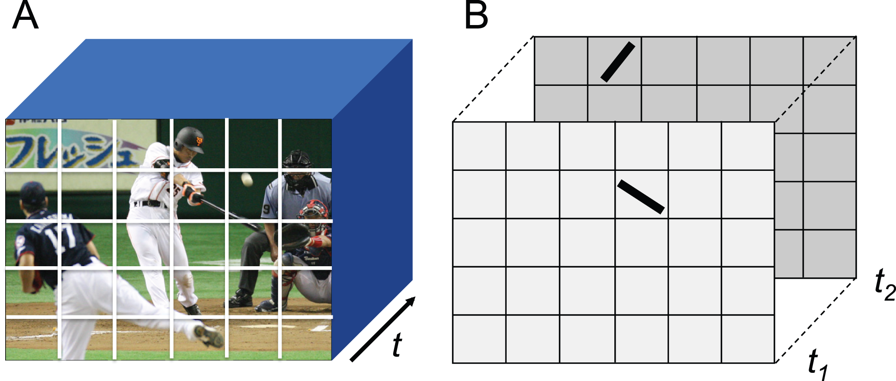

**A**: Spatiotemporal volume of an exemplary visual world. Each rectangle represents a topographically organized unit space corresponding to known receptive field of a single neuron of central visual system such as V1. **B**: Bars represent oriented line segment of simplified contours of visual events such as a swinging bat at instantaneous moments, t1 and t2. 

### Fig2. Trial paradigm
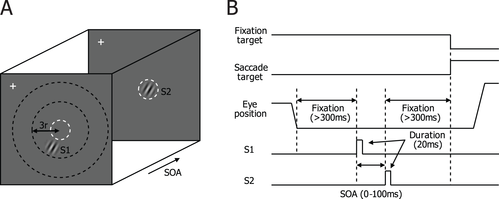

(**A**) A spatial layout of stimulus condition. A white cross indicates central fixation and the dashed white circle (invisible to the animal) represents the classical receptive field (RF). While the eye position was maintained within a window of 1 deg in radius centered about the fixation point, a static Gabor stimulus, S1, was first presented outside RF, and a second static Gabor stimulus, S2, was presented within RF. Both were presented for 20 ms each with a varying stimulus onset asynchrony (SOA), ranging from 0 to 100 ms. The animals’ task was to maintain central fixation and make a saccade following the target for liquid reward. (**B**) Temporal sequence of a trial.

### Table1. Summary of stimulus conditions
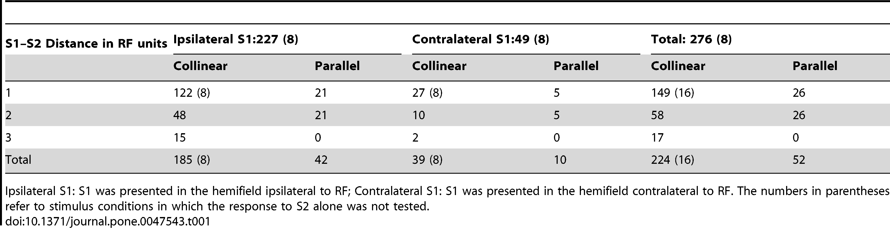

### Fig3. Response of a representative cell.
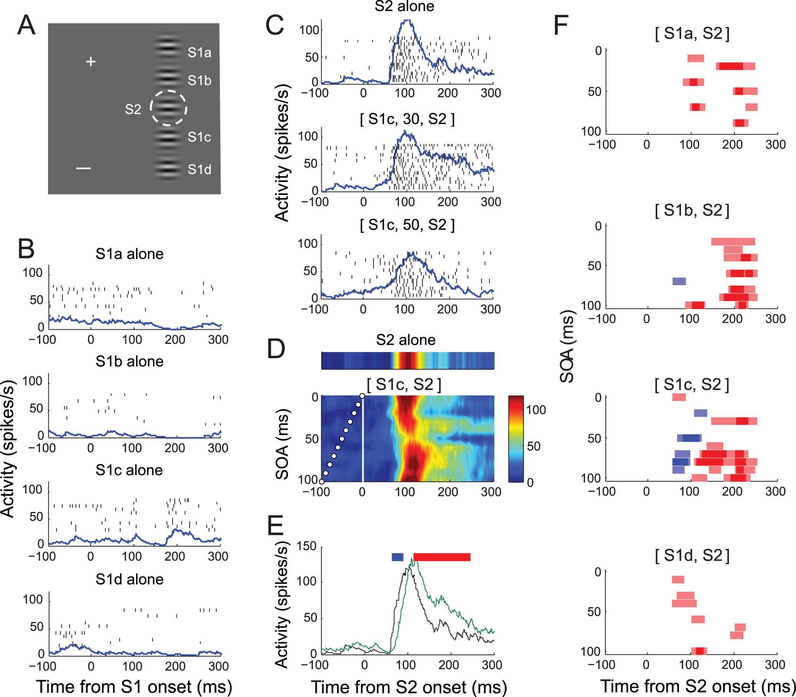

(**A**) Spatial relation between stimuli in screen coordinates (calibration bar = 1 deg). White cross represents fixation target, and the dashed circle (invisible to the animal) encloses the RF of the recorded neuron determined with a spatial summation test. Gabor stimulus at RF (S2) is at preferrred orientation. S1 was presented at one of four locations, a–d, along the axis orthogonal to that of RF orientation, with a spacing of one RF diameter. All S1 orientations were parallel to S2. There were 44 unique stimulus sequences (4 S1 positions×11 SOAs), plus five single stimulus conditions at each S1 and S2 locations. These 49 stimulus conditions were randomly repeated. (**B**) Raster and density plots of response to S1 at positions a–d aligned at its onset. Spike density function was derived by convolving spike sequence with an asymmetric kernel function [66]. Y-axis indicates spike density in spikes/s. Note that no S1 alone at positions a-d evoked spike response. (**C**) Raster and density plots for S2 alone and S1c-S2 sequence stimuli with SOAs of 30 and 50 ms chosen to illustrate response modulation. Trials are aligned at S2 onset. It can be seen that the magnitude of initial and sustained response varied with SOA. (**D**) An example SOA-time plot compiled from spike density for S1c-S2 sequence stimuli, the first stimulus at positions c and the second stimulus at RF. Y-axis is SOA, determined in 10-ms step. The times of S1 onset for each SOA condition are indicated as small white circles. Data are linearly interpolated across SOA. The S2-alone condition is given above for comparison. Note that the cell’s response varied with SOA. (**E**) Determination of significant modulation. Spike density curves for S2 alone (black) and S1c-S2 sequence with SOA of 80 ms (green), along with horizotal marks (top) of temporal epochs associated with statistically significant decrease (blue) and increase (red) from S2 alone condition. (**F**) Time course of significant modulation of spike response by sequence stimuli as shown in E. Spike density following S1–S2 sequence was compared with spike density following S2 for each of temporal epochs of 30 ms with a shift of 5 ms. The temporal epochs with a statistically-significant decrease in spike density as determined with Mann-Whitney U-test are shown in blue bars, and significant increase in red bars, centering on corresponding analysis windows, revealing the magnitude and time course of suppressive and facilitative effects of S1 that depend on S1 position and SOA. The dark symbols represent significant modulation at p<0.01, and the light ones are p<0.05. 

### Fig4. Modulation window
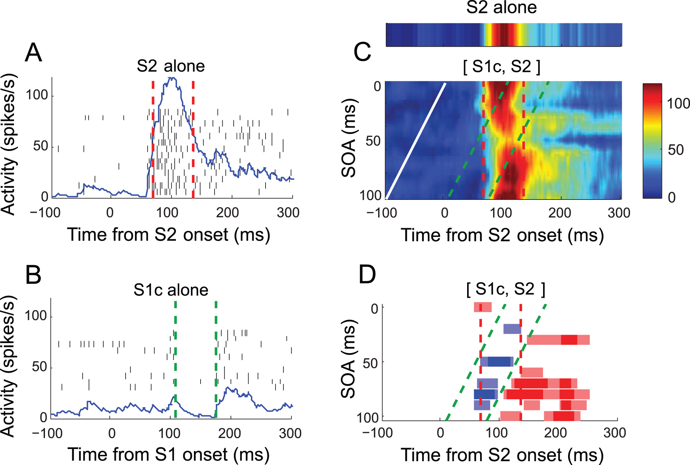

The cell of Fig. 3 is reproduced. (**A**) Response to S2 alone with the duration of 63 ms for inital transient response indicated with red dotted lines. (**B**) The duration of suppression by S1 at the position c is indicated with two green dotted lines. (**C, D**) Modulation window formed by the two durations in A and B in corresponding colors. Time of S1 onset is shown in a white line, interpolated across SOA. The S2-alone condition is given above for comparison in C. Note that the range of significant suppression and facilitation agrees well with modulation window. Also note that modulation is variable depending on SOA within modulation window.  

### Fig5. Response of another representative cell
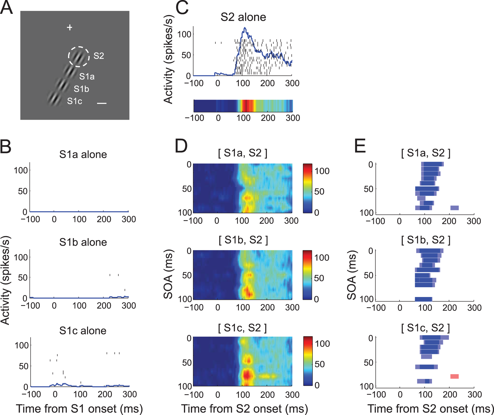

(**A**) For this cell, S1 was presented at one of three locations, a–c, as shown along the axis collinear to that of RF orientation, with a spacing of one RF diameter. Some S1s encroached on the hemifield contralateral to RF. S1 orientation was collinear to S2. There were 33 unique stimulus sequences (3 S1 positions×11 SOAs), plus four single stimulus conditions at each S1 and S2 locations. These 37 stimulus conditions were randomly repeated within a block. (**B**) Spike activity with stimulation of S1 alone at locations, a–c. The cell remained silent with S1 at all tested locations. (**C**) Spike activity with S2 stimulus alone in raster and density (upper) and color (lower) plots. (**D**) SOA-time plots in the same format as Fig. 3D, for S1 at locations, a–c, from top to bottom. Color map of activity is shown to the right. Note a periodic SOA-dependency of activity modulation (E) Time course of significant modulation of spike response by sequence stimuli in the same format as Fig. 3F for S1 at locations, a–c, from top to bottom. Note that the activity modulation by the S1 at all locations was suppressive at virtually all SOAs. All the stimulus conditions of Fig. 5 were randomized within the same block during data collection.

### Fig6. Periodic SOA-dependency of surround modulation
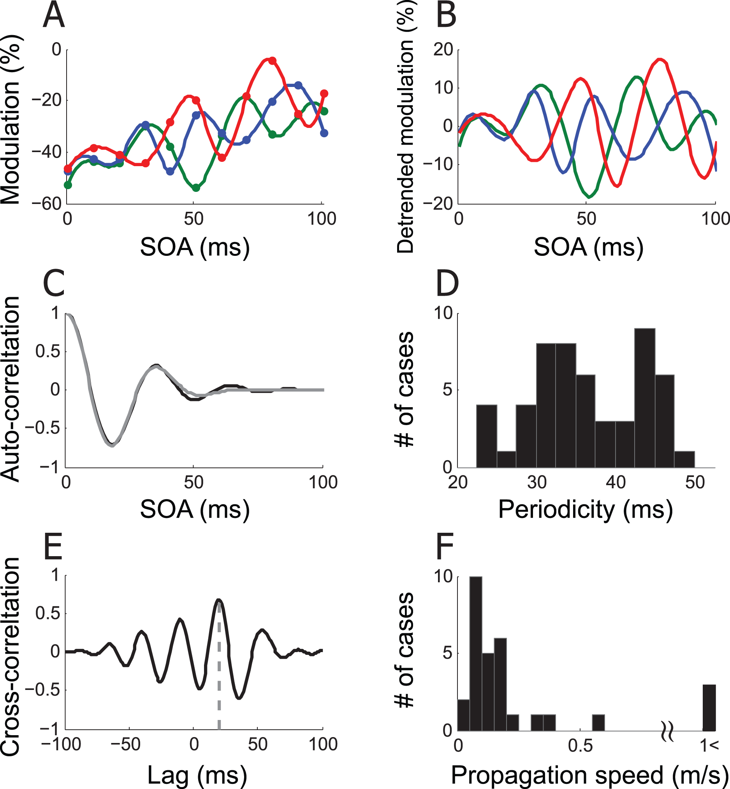

(**A**) Modulation of spike response in percentage as a function of SOA for three S1 locations of Fig. 5; green: a, blue: b, red: c. (**B**) Periodic component. The best fit linear trend was removed from the spline fit of modulation percentage in A for each S1 position to remove the monotonic component (detrend.m provided by the MATLAB). (**C**) The auto-correlogram (black) of the detrended modulation of S1a (green curve of B) was fit with a cosine-Gaussian function, (gray). (**D**) Hstogram of periodicity. Each case is the first non-zero peak of a cosine-Gaussian function, taken from 53 out of 276 stimulus conditions, for which the cosine-Gaussian fit explained more than 90% variance of auto-correlation curve. For three examples of B, R-squares are 0.99 (S1a), 0.94 (S1b), 0.99 (S1c). The mean periodicity of 53 stimulus conditions is 36.62 ms. (**E**) Cross-correlation between detrended green and blue curves of B. The time lag at the maximum cross-correlation is 20 ms. This lag reflects the distance between S1a (green) and S1b (blue). Given that cortical distance between S1a and S1b was 3.07 mm, the propagation speed in this example is estimated to be 0.15 m/s. (**F**) Histogram of propagation speed. Shown is propagation speed for each of 30 cases in which at least one S1 position passed the periodicity criteria of C. The mean distribution is 0.14 m/s without 3 outliers. The median is 0.11 m/s. 

### Fig7. Frequency histograms of response index for each SOA condition from 208 collinear (A), 52 parallel (B).
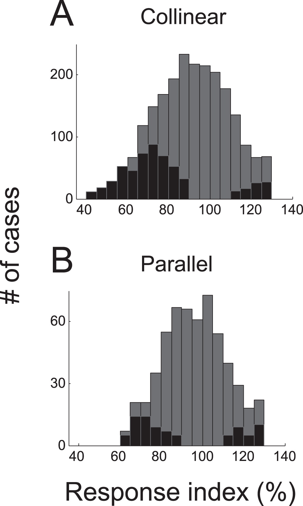

The mean indices were 91.23±18.40 and 96.28±15.24, respectively. These means are significantly less than 100% (Wilcoxon signed-rank test, all p<10−7). The proportions of significant suppression and facilitation (black bars) were 21.24 and 3.72% (**A**), and 9.44 and 5.07% (**B**), respectively. Note that suppression was more frequent than facilitation, for both collinear and parallel configurations, but this difference was larger for collinear condition.

### Fig8. Pattern of modulation for collinear (A–D) and parallel (E–H) S1 conditions
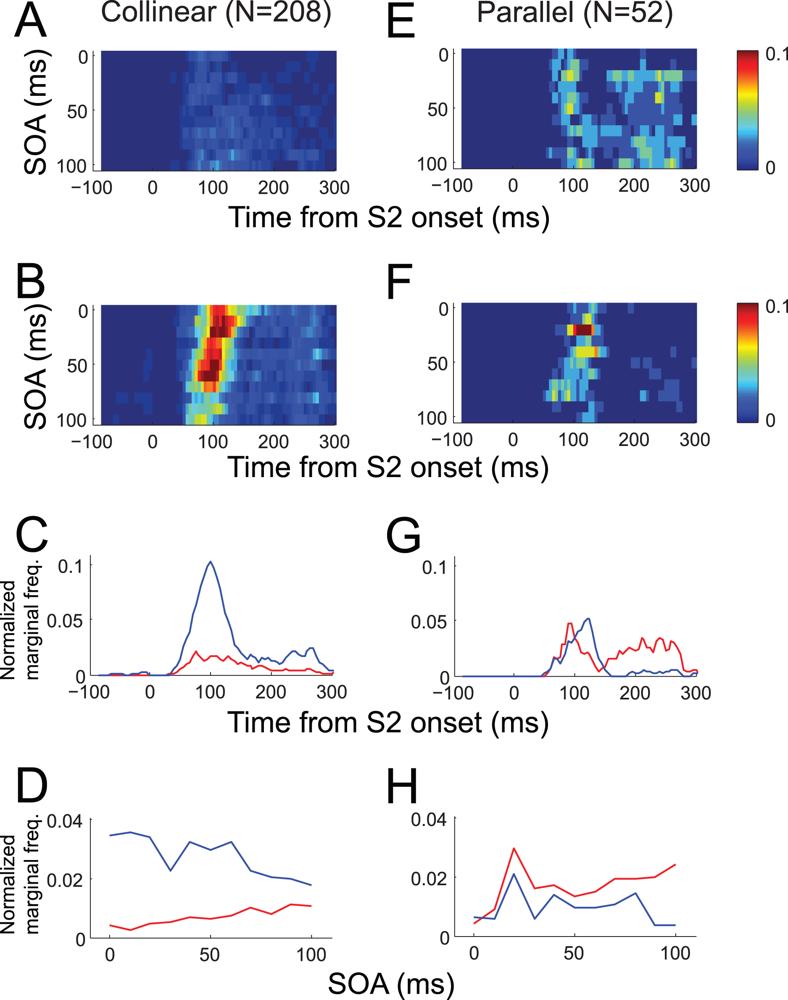

(**A**) Combined time course of SOA-dependent significant facilitation (p<0.05) from 2288 SOA conditions of 208 collinear S1 stimuli. Normalized frequency of significant epoch is color-coded according to the color map shown on the right. Out of 2288, 208 (9.09%) SOA conditions included more than one temporal epoch with significant facilitation. (**B**) Time course of significant suppression combined from the same collinear S1 configurations. In 611 of 2288 (26.70%) SOA conditions, more than one temporal epoch showed significant suppression. (**C**) Normalized marginal frequency of significant facilitation from A (red) and suppression from B (blue) against peristimulus time. (**D**) Normalized marginal frequency of significant facilitation (A, red) and suppression (B, blue) during the poststimulus time period from 0 to 300 ms against SOA. Normallized marginal frequency was derived from marginal sum divided by the number of data points. (**E–H**) Similar plots as **A–D** combined from 572 SOA conditions of 52 parallel configurations. Out of 572 SOA conditions, 96 (16.78%) and 71 (12.41%) SOA groups showed significant facilitation and suppression, respectively. Thus, suppression was relatively common with collinear S1, and the relative ratio of facilitative modulation was higher with the parallel configuration. This was true even after the distance between S1 and S2 was taken into account (by subdividing S1 configuration conditions into two distance groups, one or two RF diameter away from RF center). Note that suppressive modulation was concentrated at around 100 ms after S2 onset time (**C, G**), whereas facilitative modulation was relatively more dispersed and dominant after around 200 ms after S2 onset, especially in the parallel configuration. Also note that collinear S1 tended to suppress at short SOA and facilitate at long SOA (**D**), whereas this dissociation was relatively weak with parallel S1 (**H**).

### Fig9. Scatter plot of selectivity index and cortical distance
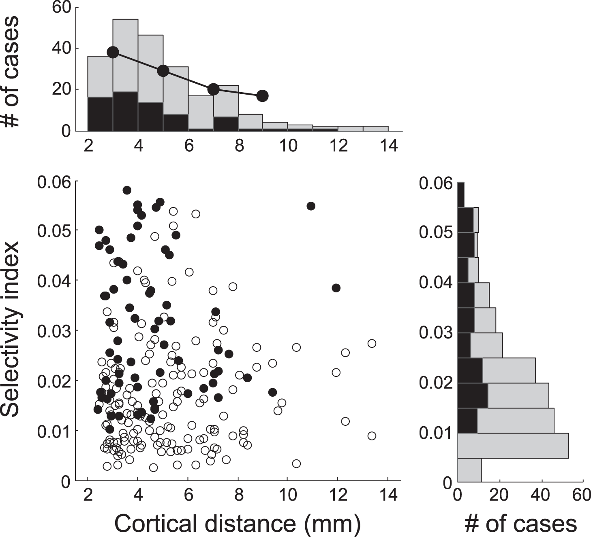

Each dot represents selectivity index (SI) for each stimulus condition and anatomical distance between the centers of S1 and S2 for that condition. Mariginal histograms are also shown. The cortical distance was estimated from the cortical magnification factor [31]. Data are combined single and multiple unit data obtained from 227 stimulus conditions (i.e., S1 positions) for 105 recording sites in 2 monkeys. Black dots and bars indicate significant SIs (69 of 227 cases, 30.40%, p<0.05), as evaluated with a bootstrapping method. The proportion was also consistent for single units alone (23 of 92 stimulus conditions, 25%) and multiple unit activitiy (46 of 135 stimulus conditions, 34.07%).The proportion of significant SI decreased with the cortical distance between S1 and S2.  

### Fig10. Effects of stimulus speed
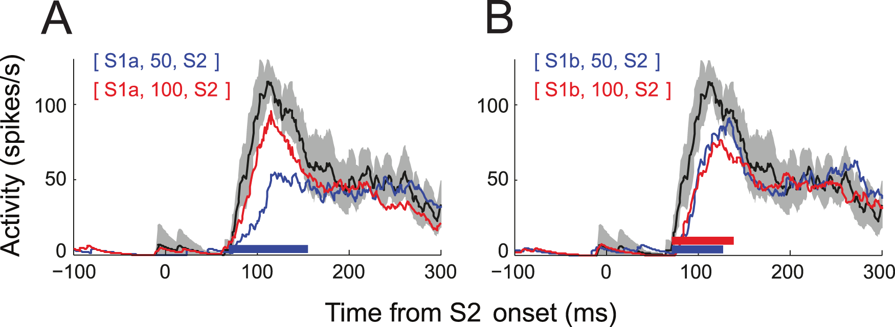

This cell is the same as Fig. 5. Time courses of spike response of the cell for S1 at one RF diameter away from S2 (**A**) and two RF diameters away (**B**) conditions. Shown in each panel are mean spike density traces for S1–S2 sequence with SOA of 50 ms (blue) and 100 ms (red). Mean spike density for the S2-alone condition is also shown for comparison (black) with its 95% confidence interval (mean±2 SEM, gray shade). All these stimulus conditions, including other SOA conditions, were randomized within the same block during data collection. Note that the peak spike response to S1a–S2 sequence with SOA of 50 ms (blue trace in A) was reduced by half compared to response to S2 alone (black). Also note that the magnitude of this response is quite different from that for S1b–S2 sequence with SOA of 100 ms (red trace in B), although the apparent motion speed of these two conditions is roughly the same.  
