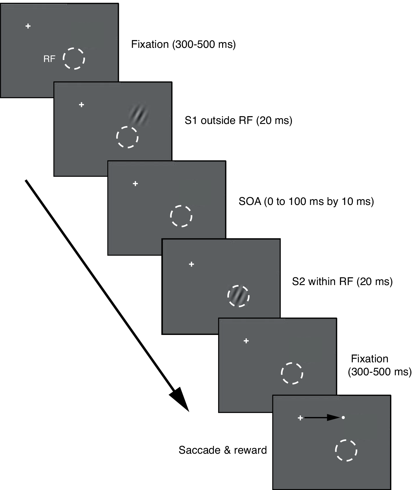
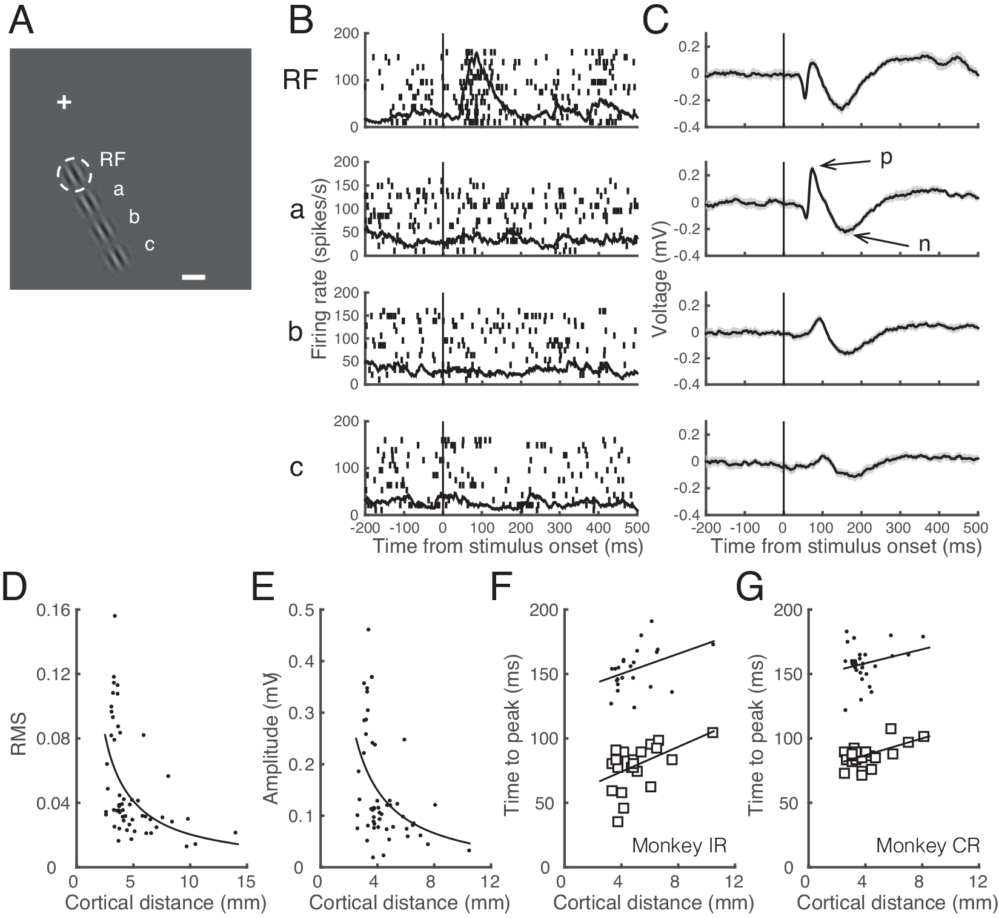
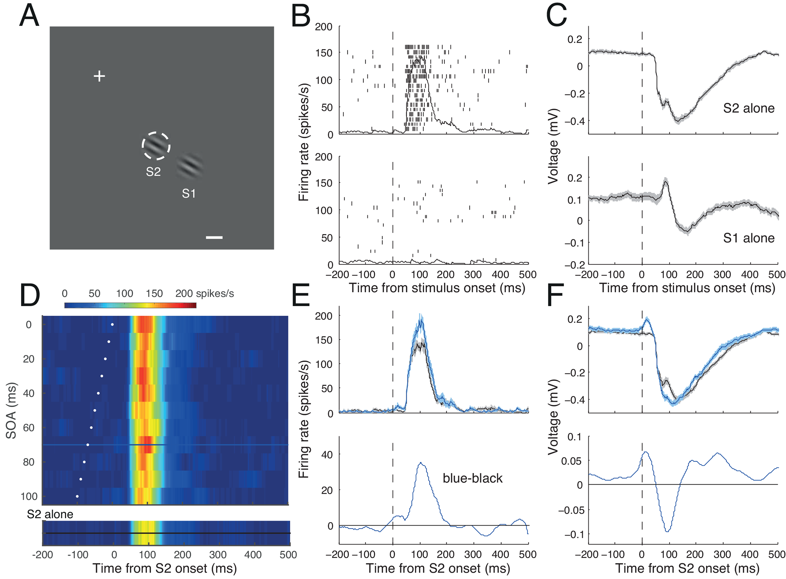
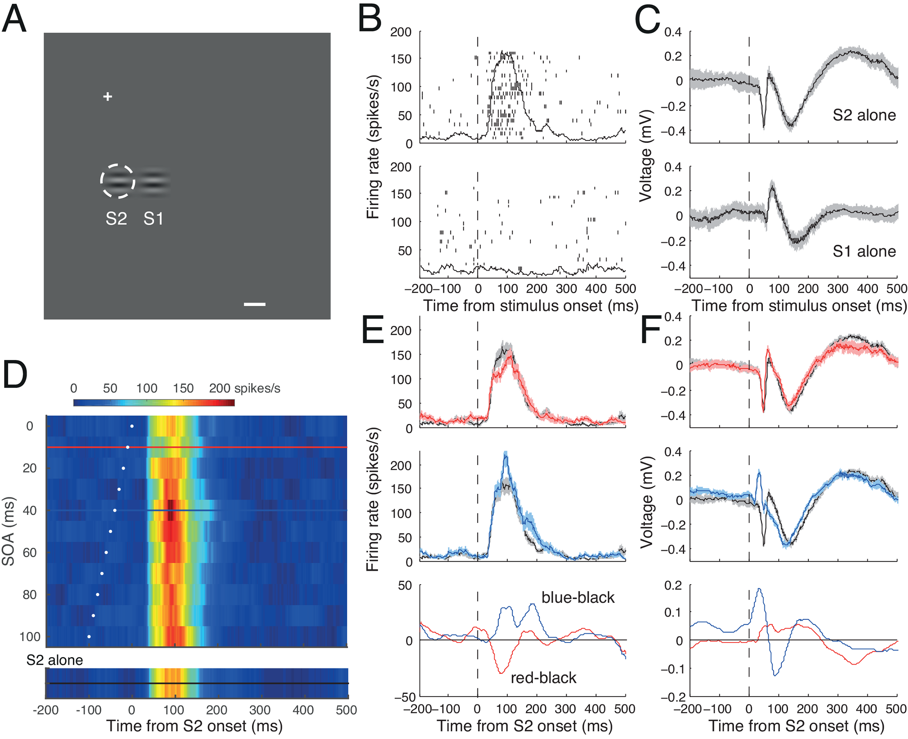
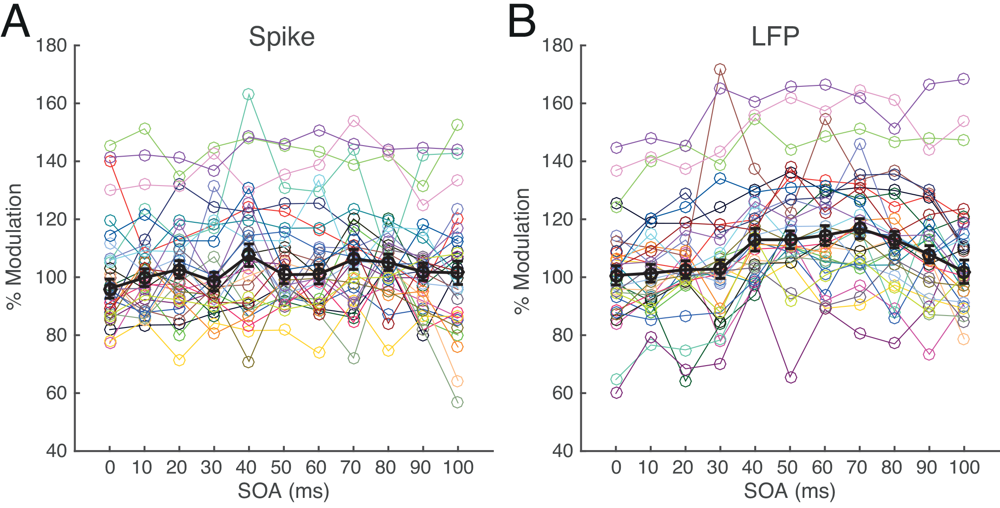
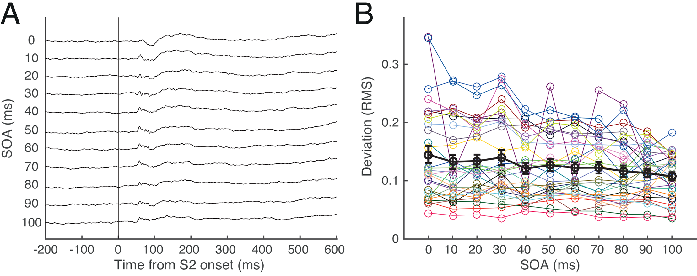
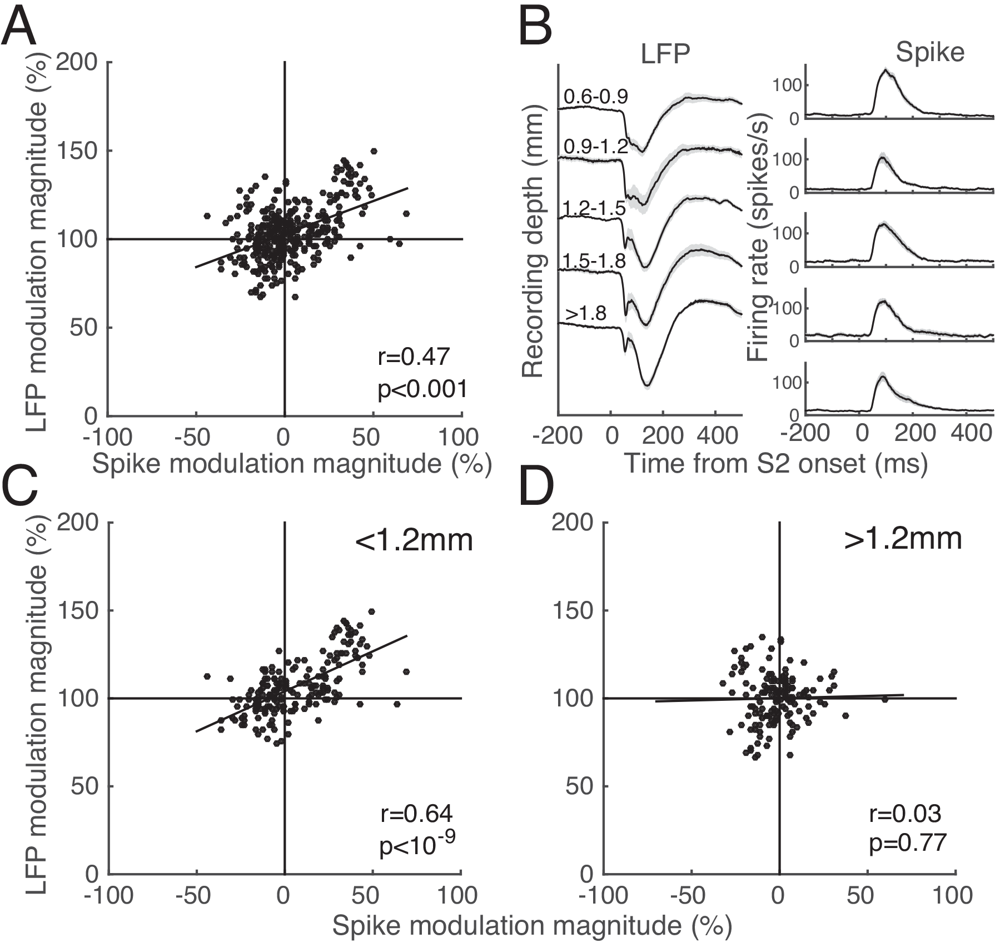
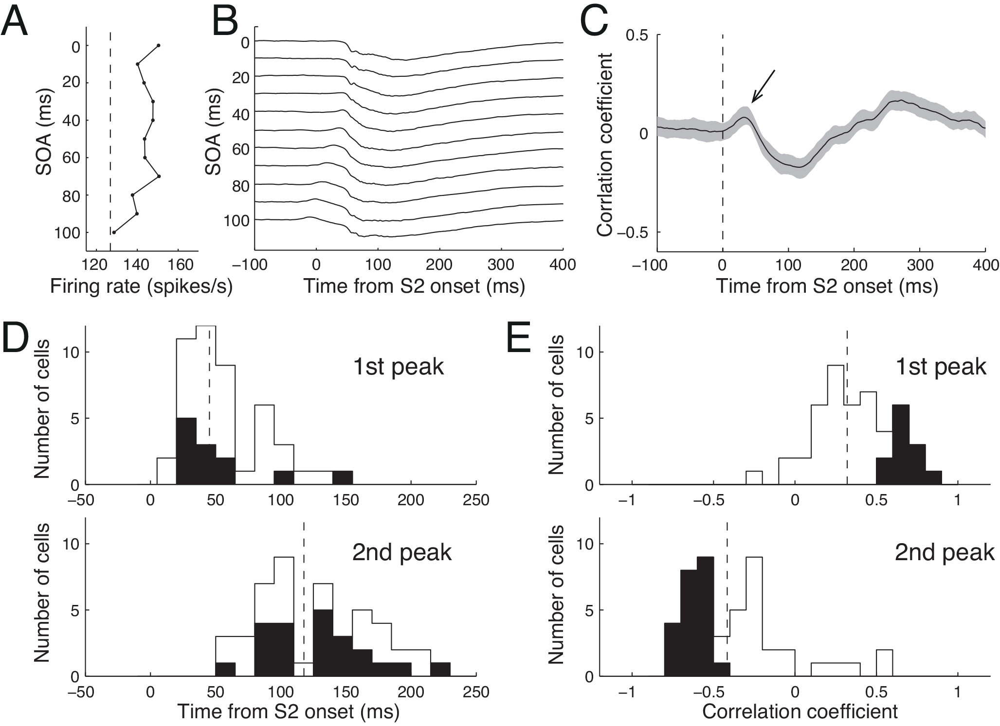

## Article info
|                    |                                                      |
|--------------------|------------------------------------------------------|
| `Authors`          | Kayeon Kim, Taekjun Kim, Taehwan Yoon, Choongkil Lee |
| `Publication date` | 2015/12/15                                           |
| `Journal`          | PLOS One                                             |
| `DOI`              | https://doi.org/10.1371/journal.pone.0144929         |

## Abstract
A focal visual stimulus outside the classical receptive field (RF) of a V1 neuron does not evoke a spike response by itself, and yet evokes robust changes in the local field potential (LFP). This subthreshold LFP provides a unique opportunity to investigate how changes induced by surround stimulation leads to modulation of spike activity. In the current study, two identical Gabor stimuli were sequentially presented with a variable stimulus onset asynchrony (SOA) ranging from 0 to 100 ms: the first (S1) outside the RF and the second (S2) over the RF of primary visual cortex neurons, while trained monkeys performed a fixation task. This focal and asynchronous stimulation of the RF surround enabled us to analyze the modulation of S2-evoked spike activity and covariation between spike and LFP modulation across SOA. In this condition, the modulation of S2-evoked spike response was dominantly facilitative and was correlated with the change in LFP amplitude, which was pronounced for the cells recorded in the upper cortical layers. The time course of covariation between the SOA-dependent spike modulation and LFP amplitude suggested that the subthreshold LFP evoked by the S1 can predict the magnitude of upcoming spike modulation.

## Figures
### Fig1.  Trial structure for S1-S2 sequence stimuli

A white cross indicates central fixation and a dashed white circle (invisible to the animal) represents the boundary of the classical receptive field (RF). The stimulus onset asynchrony (SOA) between S1 and S2 varied in steps of 10 ms. In some trials, only S1 or S2 was presented. The SOA of 0 ms corresponds to simultaneous presentation of S1 and S2. After completion of S1-S2 presentation, a saccade target was presented at one of four randomly-chosen locations, up, down, left, and right with respect to the fixation target. These target positions never were in the RF. 

### Fig2.  Properties of subthreshold (sLFP)

**A**. Spatial layout of stimulus configuration: the cross marks the central fixation target; dashed white circle represents the RF (1.6° in diameter, centered at 0.6° right and 4.1° down); a Gabor stimulus at the RF and three identical stimuli positioned outside the RF spaced at intervals of one RF diameter away from the RF along the direction collinear to preferred orientation (a, b, and c); the calibration bar indicates 1°. The distance of stimuli at a, b, and c from the RF center in cortical dimension was estimated to be 3.28, 5.89, and 8.06 mm, respectively. **B, C**. Raster and spike density plots (**B**) and mean LFP traces (**C**). Shading in **C** indicates ±2 SE. From top to bottom, responses to the Gabor stimulus at the RF alone, and those at a, b, and c alone are shown, aligned at the stimulus onset times (vertical lines). Note that a robust LFP change was evoked by the stimuli at a, b, and c, while the spike activity remained unchanged. The dominant positive and negative peaks of this sLFP are indicated as ‘p’ and ‘n’, respectively. **D**. Power (RMS) of sLFP as a function of cortical distance between the center of Gabor stimulus in the RF surround and the center of RF, extracted from data on 56 surround stimuli tested at 40 cortical sites. The curve is a fitted function in the form of , following the inverse distance law of sound pressure, where x is cortical distance in mm between the center of Gabor stimulus in the RF surround and the center of RF. Parameter A was estimated to be 0.21, and its 95% confidence limits were 0.10 and 0.31; B was estimated to be 0.00. **E**. The amplitude of the sLFP, as measured from positive to negative peaks (as shown in **C**) as a function of cortical distance between the center of Gabor stimulus in the RF surround and the center of RF for 52 conditions. Four of the 56 conditions in **D**, for which the peaks could not be determined, were excluded. The curve is a fitted function in the same form as in D. Parameter A was estimated to be 0.67, its 95% confidence limits were 0.27 and 1.07; B was estimated to be 0.02. **F, G**. Latency to positive (open squares) and negative (dots) peaks of sLFP as a function of cortical distance between the center of Gabor stimulus in the RF surround and that at the center of RF, separately for monkey IR (**F**) and monkey CR (**G**) from the 52 conditions shown in **E**. The data were separately fitted with linear regression equations: y = 4.83x+54.79 and y = 3.90x+134.46 for monkey IR, and y = 3.27x+73.90 and y = 2.71x+147.44 for monkey CR, for latency to the positive and negative peak, respectively, where x is cortical distance between the two stimuli (p<0.05 for all cases).

### Fig3. Spike and LFP activity of a representative cell

**A**. Spatial layout of stimulus configuration: the cross marks the fixation target; the dashed white circle(invisible to the animal) shows the boundary of the RF; the calibration bar indicates 1°. The RF was centered 3.3° right and 4.2° down. Two Gabor stimuli, one at the RF (S2), and the other in the RF surround (S1) are shown. **B, C**. Raster and spike density plots (**B**) and mean LFP traces (**C**) in response to S2 alone (upper) and S1 alone (lower), aligned at their onset times (dashed vertical line). Shadings in C indicate ±2 SE. Y-axis indicates spike density in spikes/s in **B**, and LFP amplitude in mV in **C**. Note that a robust LFP change was recorded in response to S1 alone, while the cell did not discharge spikes. **D**. SOA time plot for response modulation during trials with S1-S2 sequence stimuli, showing spike activity as a function of SOA and time, aligned at S2 onset. Activity is coded by color, as indicated by the calibration bar at top. White dots indicate the time of S1 onset for each SOA condition. The spike density for the S2-alone condition is given in a separate color map at bottom for comparison. Note that depending on SOA, spike density varied considerably in terms of magnitude and time course. Spike density for an SOA of 70 ms is indicated by the blue horizontal line, whereas the reference density for S2 alone (at bottom) is indicated by the horizontal black line; the time courses of both are shown in the upper panel of **E** with the same color coding. **E, F**. Upper: Spike (**E**) and LFP activity (**F**) in response to S1-S2 sequence stimuli with an SOA of 70 ms (blue), aligned at the time of S2 onset (dashed vertical lines). In each panel, a black trace indicates the reference of the S2-alone condition. Shadings indicate ±2 SE. Lower: The magnitude of modulation (S1-S2 sequence minus S2-alone) in firing rate (**E**) or LFP (**F**) is plotted for the SOA of 70 ms.

### Fig4.  Spike and LFP activity of another representative cell

Same conventions as Fig 3. **A**. The RF was centered 0.6° right and 4.0° down. **B, C**. Raster and spike density plots (**B**) and mean LFP traces (**C**) in response to S2 alone (upper) and S1 alone (lower) aligned at their onset times. Shadings indicate ±2 SE. **D**. SOA time plot. Representative spike densities for SOA of 10 and 40 ms are indicated by red and blue horizontal lines, respectively. **E, F**. Upper and middle panels: Spike (**E**) and LFP activity (**F**) in response to S1-S2 sequences with SOAs of 10 (red) and 40 ms (blue); black traces indicate references taken from the S2-alone condition. Bottom panels: The magnitude of modulation (S1-S2 sequence minus S2-alone condition) in spike (**E**) and LFP (**F**) are plotted for SOAs of 10 ms (red) 40 ms (blue). Note that for the SOA of 10 ms, the magnitude of modulation in spike activity was negative (suppressed) and the modulation of LFP was relatively weak, whereas for the SOA of 40 ms, the magnitude of modulation in spike activity was positive (facilitated) and the modulation of LFP was relatively strong.

### Fig5.  Effects of S1 on spike (A) and LFP (B) response across 11 SOA conditions

Each colored symbol represents the mean magnitude of spike (**A**) or LFP (**B**) response in percentage with respect to S2-alone condition for corresponding SOA condition of each of 30 cells for which nearest S1 was tested. Black symbols represent median values of those means with 1SEs. Percent modulations less than 100 indicate suppression and those larger than 100 indicate facilitation by addition of S1.

### Fig6. Deviation of LFP from linear sum in the representative cell of Fig 3

**A**. Shown are LFP traces in an arbitrary unit for each SOA condition derived by the mean LFP traces observed during S1-S2 sequence stimulation minus the SOA-adjusted linear sum of S1-evoked LFP and S2-evoked LFP. **B**. Deviation of LFP in RMS power. Each colored symbol represents the mean deviation across SOA conditions for each of 30 cells shown in Fig 5. Black symbols represent their mean values with 1SEs.

### Fig7. Relationship between spike and LFP modulation

**A**. Scatter plot showing the percentage changes in spike activity and RMS LFP power in the S1-S2 sequence relative to the S2-alone condition for 330 stimulus conditions (11 SOA conditions X 30 sites). They are positively related as indicated by the Pearson correlation coefficient and its p-value inside the panel. **B**. LFP (left) and corresponding spike density (right) traces from all 62 sites in which S2 alone was tested, averaged for five depth groups divided into depth segments of 300μm, measured from the surface of the dura. The deepest trace (bottom) includes all recording sites below 1800μm from the dura. The shading represents ±1 SE. **C, D**. Relationship between spike and LFP modulation subdivided into two depth groups, upper (C, <1.2mm) and lower (D, >1.2mm). Same convention as A.

### Fig8. Correlation between spike activity and LFP

**A**. SOA-dependent spike modulation for the cell shown in Fig 3. The mean firing rates during the post-stimulus period of 50–150 ms of S2 are plotted as a function of SOA. Vertical dashed lines are the reference response levels evoked by S2 alone. **B**. Simultaneously recorded mean LFP traces in an arbitrary unit for corresponding SOAs for the cell shown in **A**. Traces are vertically shifted for visibility. **C**. Time course of mean correlation between spike and LFP modulation. The correlation coefficient between the SOA-dependent firing rate (as shown in **A**) and the instantaneous amplitude of LFP (as shown in **B**) was first calculated every 1 ms for each condition. Shown is the mean correlation coefficient time course averaged over all 517 stimulus conditions (11 SOAs X 47 S1-S2 sequences) from 31 cells including cases in which S1 was tested at more than one RF diameter away. The shading represents ±1 SE. Note a positive correlation immediately after S2 onset (arrow) and a subsequent negative correlation. **D, E**. Frequency histograms of the time from S2 onset (**D**) and the correlation coefficient (**E**) for the 1st (upper) and 2nd (lower) peaks in the time course of correlation. Dashed vertical lines indicate distribution means. For the 1st peak correlation, the mean location was 45.25 ±36.0 ms and the mean correlation coefficient was 0.32 ±0.24. For the 2nd peak, the mean location was 119.32 ±38.3 ms, and the mean correlation coefficient was -0.42 ±0.33. Black bars indicate significant cases, as determined with a bootstrap statistical test (p<0.05).

